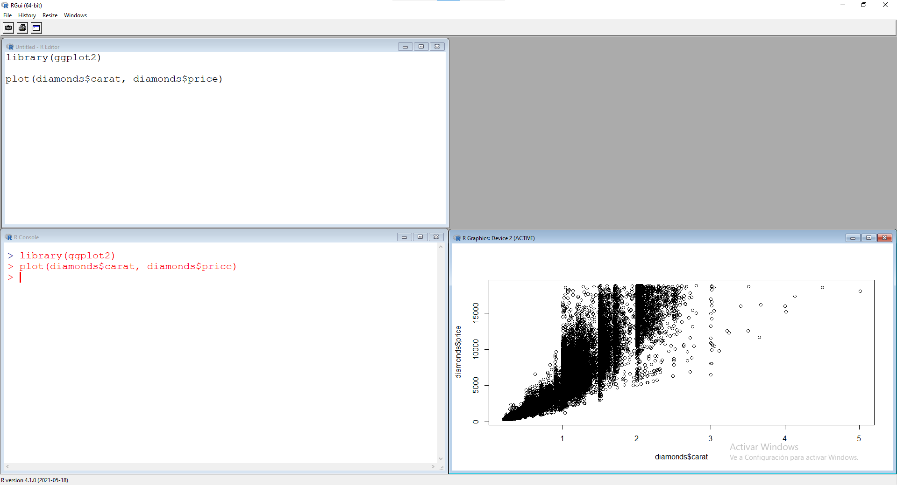
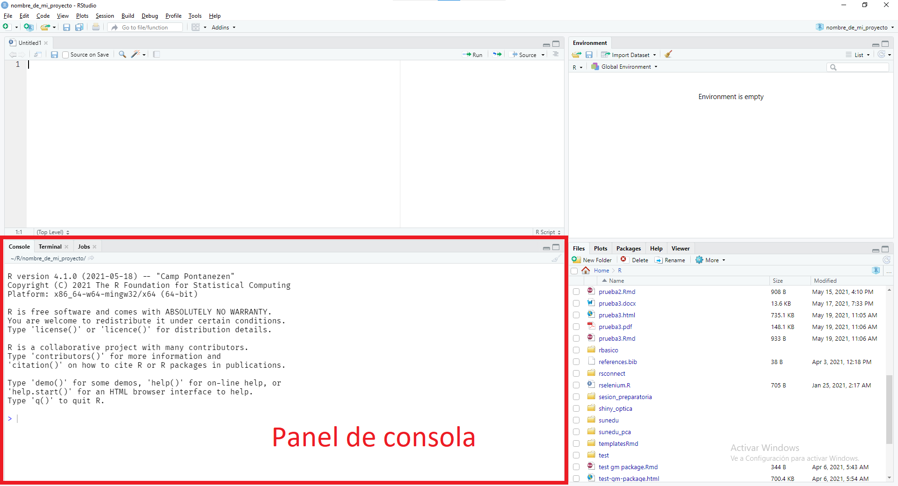
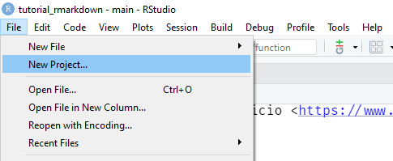
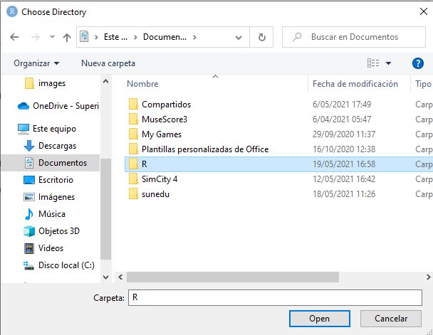
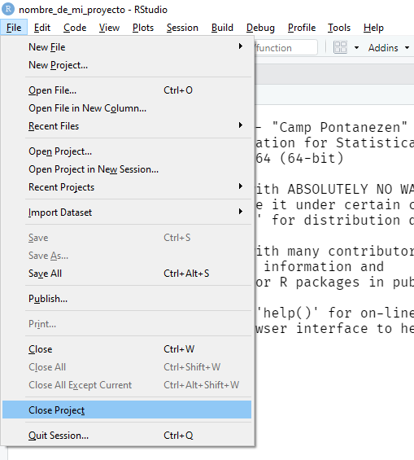

# R y el IDE RStudio {#conociendo-R}

## ¿Qué es R?

### R en la terminal

R es un lenguaje de programación. Como todo lo que ocurre en una computadora, puede ejecutarse en una ventana de terminal. En Windows la conocemos como la ventana de comandos.

{width="100%"}

Es posible acceder a la consola de R desde una terminal.

-   Windows: escribir la ubicación del ejecutable de R
-   Mac o Linux: escribir `R`

{width="100%"}

{width="100%"}

### El Rgui como editor

En los años 2000, se elaboró una interfaz más amigable y dedicada a trabajar con R llamada "R Graphic User Interface" (Rgui).

{width="50%"}

Esta interfaz nos conecta directamente a la consola y nos brinda la opción de tener un editor de scripts, previsualizar nuestros gráficos, entre otras cosas.

{width="100%"}

### RStudio

En la década de los 2010 aparece el proyecto RStudio, gracias al trabajo de J.J. Allaire.

{width="100%"}

Su desarrollo inició en diciembre de 2010 y su primera versión oficial se lanzó en noviembre de 2016. Es el editor con el que trabajaremos en estas sesiones.

{width="100%"}

## El editor de código RStudio

Generalmente, no será necesario acceder a R a través de una terminal ni del Rgui, porque lo haremos utilizando el entorno de programación RStudio, que nos brinda una consola de R automáticamente.

Rstudio nos brinda varios paneles que cumplen distintas funciones. Es importante mencionar que el siguiente listado toma en cuenta la ubicación por defecto de los paneles, ya que se pueden modificar según el gusto de cada usuario.

### El panel de edición

{width="100%"}

En este panel aparecerán todos los archivos editables. RStudio nos brinda la opción de utilizar múltiples tipos de archivo y de tener varios abiertos al mismo tiempo.

Entre los formatos que se pueden abrir y editar en este panel encontramos:

-   *.R*: Scripts de R
-   *.Rmd*: Archivos R Markdown
-   *.py*: Scripts de Python
-   *.html*: Documentos en formato HTML
-   *.css*: Hojas de estilo de cascada
-   *.txt*: Documentos de texto sin enriquecer
-   *.csv*: Archivos de valores separados por comas
-   etc

En el panel de edición también podremos obtener un visor de datos cada vez que lo solicitemos.

### El panel de consola

{width="100%"}

En el panel de consola encontramos directamente la consola de R lista para ser usada.

Generalmente, este panel es usado directamente en ocasionas muy puntuales, ya que la mayor parte del tiempo se trabajará con código en el panel de edición.

Cabe mencionar que este panel también brinda acceso a una pestaña de Terminal y a una pestaña de ejecución de trabajos en paralelo (Jobs).

### El panel de environment

{width="100%"}

Desde este panel tenemos acceso a todos los environment de nuestra sesión de R. Cuando creemos un objeto, nos aparecerá listado en este panel.

Cuando trabajemos en otros tipos de proyectos, como la creación de paquetes, conexión remota a bases de datos, creación de páginas web, uso de sistemas de control de versiones, etc, este panel tendrá otras pestañas para mostrar el estado de esos trabajos.

### El panel de apoyo

{width="100%"}

Este panel nos permitirá previsualizar el resultado de nuestro trabajo. Cuenta con lo siguiente:

-   Explorador de archivos (Files)
-   Ventana de gráficos (Plots)
-   Explorador de paquetes instalados (Packages)
-   Ventana de ayuda (Help)
-   Visualizador de contenido Web (View)

## El directorio de trabajo

El directorio de trabajo es donde R busca los archivos que le pides cargar, y donde pondrá los archivos que le pidas guardar. RStudio muestra el directorio de trabajo en la parte superior de la consola.

En muchas ocasiones existe la tentación de trabajar con archivos que están fuera de nuestro directorio de trabajo. Es recomendable evitar este comportamiento porque suele ser la raíz de muchos problemas.

Para ello, RStudio cuenta con los *Proyectos*, una manera sencilla de organizar nuestro trabajo. Mi mayor recomendación para usuarios de RStudio iniciantes y especialistas es trabajar ***siempre*** con proyectos dentro de RStudio.

### Asignar directorio de trabajo por defecto

El directorio de trabajo por defecto es la carpeta en la que R usará cada vez que no estemos dentro de un proyecto. Por defecto, es la carpeta de "Documentos" del usuario de la computadora.

RStudio cuenta con un explorador de archivos para revisar el contenido de nuestros directorios.

{width="100%"}

Mi recomendación personal es utilizar como directorio general la carpeta llamada "R" dentro de "Documentos".

1.  Acceder a "Global options" dentro del Menú "Tools".
2.  En las opciones generales, elegir la carpeta "R" como *Default working directory*.

{width="100%"}

{height="100%"}

## Proyectos

### Crear proyectos

Puedes crear un proyecto siguiendo la siguiente ruta:

1.  Ir al menú "File"
2.  Hacer click en "New Project"
3.  Elegir "New directory"
4.  Elegir "New project" (las demás opciones son plantillas para proyectos típicos con los que te podrás familiarizar más adelante)
5.  Indicar el nombre del proyecto
6.  Elegir la carpeta en la que se guardará el proyecto. (Recomiendo que sea la carpeta "R")
7.  Hacer click en "Create project"

Si estás usando el servicio <https://www.rstudio.cloud> puedes crear nuevos proyectos en tu espacio de trabajo (Your workspace).

1.  Ir al menú file

{width="100%"}

<ol start=2>

<li>

Hacer click en "New Project"

</li>

{width="100%"}

<ol start=3>

<li>

Elegir "New directory"

</li>

<ol start=4>

<li>

Elegir "New project"

</li>

Las demás opciones son plantillas para proyectos típicos con los que te podrás familiarizar más adelante

<ol start=5>

<li>

Indicar el nombre del proyecto

</li>

<ol start=6>

<li>

Elegir la carpeta en la que se guardará el proyecto

</li>

Recomiendo que sea la carpeta "R"

<ol start=7>

<li>

Hacer click en "Create project"

</li>

RStudio te dará varias señales de que creaste exitosamente tu proyecto. También, te indicará cuál es el directorio de trabajo de tu proyecto.

{width="100%"}

### Usar un proyecto

Al crear un nuevo proyecto, RStudio crea para ti una carpeta con un archivo que lleva un nombre tipo *"\*.Rproj"*.

{width="100%"}

Cuando estés fuera del proyecto bastará con hacer doble click en ese archivo para que RStudio abra una sesión de trabajo usando la ubicación del proyecto.

{width="100%"}

{width="100%"}

Si deseas cerrar el proyecto actual para trabajar en otro, puedes hacerlo desde el menú "File" haciendo click en "Close Project".

{width="45%"}
