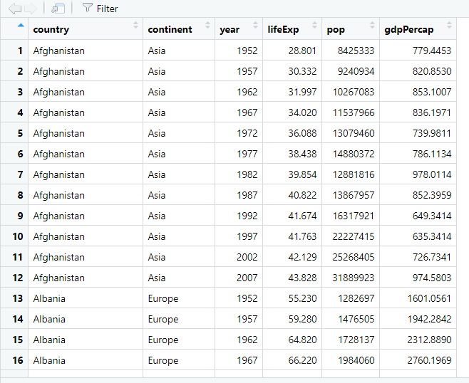

# Transformación

## Tibbles

Hasta el momento hemos trabajado usando tablas que hemos leído desde un paquete descargado o que hemos importado desde un archivo local. 

Por ejemplo, `gapminder`.

Cuando lo leemos, obtenemos un *tibble*.

```{r}
library(gapminder)

gapminder
```

Un tibble es una tipo especial de tabla. R muestra un tibble en una manera sencilla: Se mostrarán solo las 10 primeras filas del tibble, así como todas las columnas que quepan en tu ventana de consola o documento R Markdown. R también agrega información útil acerca del tibble, como los tipos de datos de cada columna y el tamaño del conjunto de datos.

Los tibbles son una versión mejorada de los *data.frames*, la forma en que R trabaja con datos tabulares.

Los tibble son objetos ampliamente utilizados en la actualidad y son parte fundamental del [*tidyverse*](https://www.tidyverse.org/), un conjunto de paquetes que comparten una filosofía en común, con el fin de hacer el análisis de datos más accesible y reproducible. 

Esta filosofía es visiblemente respaldada por los desarrolladores de RStudio. Debido a esta popularidad , es bastante probable que cuando veas que alguien está hablando de un data.frame, en realidad se esté refiriendo a un tibble.

```{r, eval=FALSE}
library(tidyverse) # carga el paquete tibble
```


## Visualizar datos

Es posible acceder a una ventana de visualización de tablas en el panel de Edición si usamos la función `View()` en nuestra sesión de RStudio. Es el mismo panel que aparece cuando hacemos click en el nombre de una tabla en el *Environment*.

```{r, eval=FALSE}
View(gapminder)
```

{width=400px}

## El paquete `dplyr`

El paquete `dplyr` nos permite transformar nuestros datos tabulares. Una ventaja de este paquete es que sus funciones utilizan verbos para representar las acciones que queremos realizar en el contexto de nuestro análisis de datos. Por ejemplo:

- **Seleccionar** variables por su nombre con `select()`.
- **Filtrar** observaciones de acuerdo a sus valores con `filter()`.
- **Organizar** las filas de acuerdo a sus valores con `arrange()`.
- **Modificar** las variables de nuestro conjunto de datos con `mutate()`.
- **Resumir** nuestros datos en valores representativos con `summarise()`.
- **Agrupar** nuestros datos para operar en ellos con `group_by()`.

Otra característica de las funciones *verbo* de `dplyr` es que su primer argumento será siempre el *tibble* que queremos transformar. Más adelante, esto permitirá encadenar las funciones con el operador *pipe*.

Todas las operaciones descritas anteriormente pueden hacerse con funciones de *R base*, sin embargo no con una interfaz consistente entre funciones y paquetes.

Para poder usar sus funciones, debemos cargar el paquete. Como forma parte de los paquetes del tidyverse, podemos cargar todos juntos a la vez.

```{r dplyr}
# Para cargar sólo dplyr
library(dplyr)
```

```{r, include=FALSE}
detach(package:dplyr)
```

```{r}
# Para cargar todo el tidyverse
library(tidyverse)
```

## Transformación de columnas

### Cambiar nombre de una columna

Usar `rename()`.

Esta función nos permite cambiar el nombre de nuestras columnas. Debemos especificar:

1. El nombre del conjunto de datos
2. El cambio de nombre, usando la sintaxis `nuevo_nombre = nombre_anterior`


```{r}
gapminder %>% 
    rename(pais = country)
```

### Cambiar nombre de varias columnas

Es posible cambiar más de un nombre a la vez.

```{r}
gapminder %>% 
    rename(pais = country,
           continente = continent, 
           anio = year,
           exp_de_vida = lifeExp,
           poblacion = pop,
           pbi_per_cap = gdpPercap)
```

### Cambiar posición de una columna

Usar `relocate()`.

Esta función permite cambiar la ubicación de nuestras columnas. Debemos especificar:

1. El nombre del conjunto de datos
2. Los nombres de columna que queremos reubicar


Por defecto, pondrá las columnas especificadas como primera columna.

```{r}
gapminder %>% 
    relocate(gdpPercap)
```

---

Es posible especificar una posición en especial con los argumentos `.before` (antes) o `.after` (después).

```{r}
gapminder %>% 
    relocate(gdpPercap, .before = year)
```

```{r}
gapminder %>% 
    relocate(gdpPercap, .after = year)
```

### Seleccionar columnas

La función `select()` nos permite seleccionar columnas específicas de nuestro  tibble Supongamos que sólo queremos los nombres de los países, el año y el total de población. Podemos hacerlo con `select()`.

Debemos especificar:

1. El nombre del conjunto de datos
2. Las variables a escoger

Las columnas escogidas aparecen en el orden especificado.

```{r}
gapminder %>% 
    select(country, year, pop)
```

También es posible escoger columnas usando su posición en el conjunto de datos con números.

```{r}
gapminder %>% 
    select(1, 3, 5)
```

Sin embargo, no recomiendo usar esta manera de selección porque el código es más dificil de interpretar.

### Remover columnas

Anteponerle el signo negativo al nombre de la columna en `select()`. En este ejemplo queremos dejar fuera la columna `pop` y `lifeExp`.

```{r}
gapminder %>% 
    select(-pop, -lifeExp)
```


### Cambiar nombres en selección

Usando `select()` con una sintaxis como la de `rename()` para cambiar el nombre de las columnas al mismo tiempo que seleccionarlas.

```{r}
gapminder %>% 
    select(pais = country, 
           anio = year,
           poblacion = pop)
```

El código anterior es equivalente a combinar ambas operaciones.

```{r}
gapminder %>% 
    select(country, year, pop) %>% 
    rename(pais = country,
           anio = year,
           poblacion = pop)
```


### Opciones avanzadas de selección

La función `select()` puede hacer uso de funciones de apoyo del paquete `tidyselect()`, que se cargan automáticamente junto con `dplyr`.

Para ejemplificar, usaremos el conjunto de datos `flights` del paquete `nycflights13`.

---

```{r}
library(nycflights13)

flights
```

#### Seleccionar columnas en secuencia

Es posible seleccionar una secuencia de variables consecutivas si usamos el operador de secuencia (`:`).

```{r}
flights %>% 
    select(dep_time:sched_arr_time)
```

#### Seleccionar columnas según un patrón 

Es posible usar funciones que nos permiten hacer *match* de los nombres de nuestras columnas con caracteres de texto:

- `starts_with()`: El nombre empieza con un prefijo determinado
- `ends_with()`: El nombre termina con un sufijo determinado
- `contains()`: El nombre contiene una cadena de texto
- `matches()`: El nombre hace *match* con una *expresión regular* (avanzado)

Los patrones de texto deben especificarse entre comillas (`"`).

```{r}
flights %>% 
    select(starts_with("dep"))
```

```{r}
flights %>% 
    select(ends_with("delay"))
```

```{r}
flights %>% 
    select(contains("time"))
```

```{r}
flights %>% 
    select(matches("a(i|r)r_time"))
```

#### Seleccionar avanzado simultáneo

Es posible combinar todas las formas de selección dentro de una sola llamada a `select()`.

```{r}
flights %>% 
    select(year:day, starts_with("arr"))
```

## Transformación filas

### Obtener un subconjunto de datos

La función `filter()` nos simplifica la tarea de hacer *subsetting* (escoger un subconjunto de nuestros datos). Debemos especificar dos elementos:

1. El nombre del conjunto de datos
2. La condición que tiene cumplir una observación para permanecer.

Para establecer las condiciones, debemos usar operaciones lógicas. Del mismo modo que los operadores aritméticos nos permiten obtener un resultado aritmético (*aka*, numérico) en nuestros cálculos, existen otros operadores que nos permiten obtener resultados lógicos.

En esta sección, usaremos `gapminder` como ejemplo.

#### Operadores relacionales

Los primeros de ellos son los relacionales, y ya los conocemos desde el colegio, pero es bueno saber cómo escribirlos en R. La siguiente tabla nos muestra para qué sirve cada uno de ellos.

|Operador|Uso              |
|-------:|:----------------|
|`==`    |Igual que        |
|`!=`    |Diferente que    |
|`>`     |Mayor que        |
|`<`     |Menor que        |
|`>=`    |Mayor o igual que|
|`<=`    |Menor o igual que|

#### Subsetting basado en un solo valor

De entre todas las observaciones, podemos escoger aquellas cuyo país sea "Perú". Para ello, usamos la operación `country == "Peru"`.

```{r}
gapminder %>% 
    filter(country == "Peru")
```

También podemos hacer comparaciones basadas en números. Por ejemplo, todas las observaciones correspondientes al año 2007.

```{r}
gapminder %>% 
    filter(year == 2007)
```

Podemos escoger sólo aquellas observaciones que cuya población sea mayor a mil millones.

```{r}
gapminder %>% 
    filter(pop > 1000000000)
```

Podemos escoger las observaciones cuya expectativa de vida sea menor a 30 años.

```{r}
gapminder %>% 
    filter(lifeExp < 30)
```

#### Subsetting basado en múltiples valores

Si usamos más de una condición, sólo permanecerán aquellas que cumplan con todas las expuestas. Por ejemplo, observaciones donde la población sea mayor a mil millones y la expectativa de vida mayor a 70 años.

```{r}
gapminder %>% 
    filter(pop > 1000000000, lifeExp > 70)
```

Países de América a partir del 2002 cuyo PBI per cápita fue mayor a $15000.

```{r}
gapminder %>% 
    filter(continent == "Americas", year >= 2002, gdpPercap > 15000)
```

#### Operadores lógicos

Para potenciar nuestras habilidades de comparación, podemos hacer uso de operadores lógicos. La siguiente tabla te muestra cuáles son:

|Operador|Uso      |
|-------:|:--------|
|`&`     |Y lógico |
|`|`     |O lógico |
|`!`     |NO lógico|

Pueden usarse para obtener combinar comparaciones.

#### `&` (Y lógico)

El Y lógico, en el contexto de `filter()` funciona de manera similar a ir agregando nuevas condiciones. Permite que permanezcan observaciones que satisfagan **todas** las condiciones. Por ejemplo, para obtener observaciones donde la población sea mayor a mil millones y la expectativa de vida mayor a 70 años.

```{r}
gapminder %>% 
    filter(pop > 1000000000 & lifeExp > 70)
```

#### ` | ` (O lógico)

El O lógico permite que permanezcan las observaciones que satisfagan **al menos una** de las condiciones indicadas. Por ejemplo, para obtener las observaciones correspondientes a Perú o Colombia.

```{r}
gapminder %>% 
    filter(country == "Peru" | country == "Colombia")
```

Es posible ir agregando cuantos O lógicos sean necesarios para obtener todas las observaciones de un listado de países. Por ejemplo, los que pertenecen a la Alianza del Pacífico.

```{r}
gapminder %>% 
    filter(country == "Peru" | country == "Chile"| country == "Colombia"| country == "Mexico")
```

#### `%in%`

R permite usar el operador `%in%` para usar condiciones basadas en un O lógico de manera más sencilla.

```{r}
gapminder %>% 
    filter(country %in% c("Peru", "Chile", "Colombia", "Mexico"))
```

#### `!` (NO lógico)

Puedes usar un NO lógico para obtener lo opuesto a lo indicado en tu condición. Por ejemplo, observaciones cuyo continente no sea Américas o Europa.

```{r}
filter(gapminder, ! continent %in% c("Americas", "Europe"))
```

### Organizar filas según sus valores

Para esto, usar el verbo `arrange()`.

Para el siguiente verbo vamos a trabajar con un subconjunto de observaciones de gapminder.

```{r}
gapminder_subset <- filter(gapminder, 
       country %in% c("Peru", "Chile", "Colombia", "Mexico"),
       year >= 2002)
```


```{r}
gapminder_subset
```

`gapminder_subset` está ordenado por el orden alfabético de la columna `country`.

La utilidad de `arrange()` es que nos permite ordenar nuestros datos en base a las variables que escojamos. Debes identificar:

1. El nombre del conjunto de datos
2. Las columnas para el ordenamiento y su tipo de orden.

Por defecto, el conjunto de datos se ordenará de manera ascendente. Los caracteres de texto se ordenarán en orden alfabético y los números de menor a mayor.

#### Organizar según los valores de una columna

Podemos indicar que el conjunto de datos se ordene por año.

```{r arrange_ejm1}
gapminder_subset %>% 
    arrange(year)
```

Ahora aparecen primero los datos del 2002 y luego los del 2007. Por defecto, el orden se hace en forma ascendente. 

Al usar `arrange()`, si uso la función `desc()` rodeando la columna elegida, el orden ahora es *descendente*.

```{r arrange_ejm2}
gapminder_subset %>% 
    arrange(desc(year))
```

#### Organizar en base a más de una columna

Puedo ordenar en base a más de una columna, sólo debo agregarla como otro argumento. Por ejemplo, si quiero ver el orden en las expectativas de vida por año.

```{r arrange_ejm3}
gapminder_subset %>% 
    arrange(year, lifeExp)
```


## Transformación del conjunto de datos

### Crear o modificar variables

Para ello usamos la función `mutate()`

Esta función se usa para modificar las variables de nuestro conjunto de datos, ya sea para transformar una variable existente o para crear una nueva. Debemos identificar dos cosas:

1. El nombre del conjunto de datos
2. El nombre de la variable objetivo y la operación necesaria para crearla y modificarla.

La operación debe hacerse en una variable existente. Si la variable objetivo ya existe en el conjunto de datos, será sobreescrita.

#### Calcular nueva variable

En `gapminder_subset` contamos con información del PBI per cápita y población. Multiplicando ambas podemos tener el PBI total de un país para determinado año.

```{r}
gapminder_subset %>% 
    mutate(pbi_total = pop * gdpPercap)
```

Ten en cuenta que si la operación retorna un solo valor, este será repetido en todas las filas de esa variable.

```{r}
gapminder_subset %>% 
    mutate(maxima_pob = max(pop))
```

También considera que si usas como nombre de variable objetivo algún nombre de variable que ya existe en tu conjunto de datos, será sobreescrita.

```{r}
gapminder_subset %>% 
    mutate(pop = max(pop))
```

#### Recategorizar variable a dicotómica

Usar `mutate()` y `if_else()`.

Cuando queremos recategorizar una variable de manera dicotómica, podemos usar la función `if_else()`. Sirve para testear una condición, que de ser verdadera asume el primer valor, y en caso contrario el segundo.

Por ejemplo, para traducir el nombre de nuestros continentes.

```{r}
gapminder_subset %>% 
    mutate(traduccion = if_else(continent == "Europe", "Europa", "América"))
```

Si usamos el mismo nombre que el de una variable existente, nuestra variable será sobreescrita con sus nuevos valores.

```{r}
gapminder_subset %>% 
    mutate(lifeExp = if_else(lifeExp >= 75, "70 o más", "Menos que 70"))
```

#### Recategorizar variable con múltiples valores

Usar `mutate()` y `case_when()`.

En estos casos, usamos la función `case_when()` que permite testear múltiples condiciones. Para abarcar las observaciones que no cumplan ninguna condición, se usa el valor `TRUE`.

```{r}
gapminder_subset %>% 
    mutate(exp_recat = case_when(lifeExp <= 70 ~ "Menor o igual a 70",
                                               lifeExp <= 75 ~ "Entre 71 y 75",
                                               TRUE ~ "Mayor que 75"))
```

### Obtener tabla de valores de resumen de todo el conjunto de datos

Para esto usamos `summarise()`.

Es una función que nos permite obtener datos resumen de nuestras variables. Algo a tener en cuenta es que al hacer nuestro conjunto de datos sólo retendrá los datos de resumen, obviando la data de la cual fueron obtenidos. Debemos identificar dos cosas:

1. El nombre del conjunto de datos
2. El nombre de la variable resumen objetivo y la operación necesaria para crearla y/o modificarla.

Algunos valores de resumen que podemos obtener de nuestros datos son los siguientes:

- Recuento: usar `n()` sin especificar ninguna variable. Permite obtener la cantidad de observaciones en nuestros datos.
- Recuento de únicos: usar `n_distinct(x)` donde `x` representa la variable a resumir
- Suma: usar `sum(x)` donde `x` representa la variable a resumir
- Promedio: usar `mean(x)` donde `x` representa la variable a resumir
- Mediana: usar `median(x)` donde `x` representa la variable a resumir
- Mínimo: usar `min(x)` donde `x` representa la variable a resumir
- Máximo: usar `min(x)` donde `x` representa la variable a resumir
- Máximo: usar `min(x)` donde `x` representa la variable a resumir
- Rango intercuartil: usar `IQR(x)` donde `x` representa la variable a resumir

#### Calcular un valor de resumen para una variable

Podemos obtener el recuento de observaciones de nuestra tabla si usamos `n()`. Esta función nos devuelve la cantidad de observaciones en nuestros  conjunto de datos. En el mismo código podemos asignarle un nombre a la columna, en este caso le ponemos `recuento`.

```{r summarise_n}
gapminder_subset %>% 
    summarise(recuento = n())
```

#### Calcular múltiples valores de resumen para una variable

Podemos obtener más de una medida en un solo llamado a `summarise()`. Por ejemplo, podemos obtener el promedio y mediana del PBI per cápita. Además, podemos aprovechar para obtener la diferencia entre ambas medidas dentro del mismo llamado.

```{r}
gapminder_subset %>% 
    summarise(promedio = mean(gdpPercap), 
              mediana = median(gdpPercap),
              diferencia = promedio - mediana)
```

#### Calcular múltiples valores de resumen para múltiples variables

Podemos obtener más de una medida en un solo llamado a `summarise()`. Para obtener valores de resumen de distintas variables basta con operar en las variables que necesitamos. Por ejemplo, para obtener el promedio del PBI per cápita, la mediana de la población y el máximo de la expectativa de vida:

```{r}
gapminder_subset %>% 
    summarise(prom_pbi_percap = mean(gdpPercap), 
              mediana_pob = median(pop),
              max_exp = max(lifeExp))
```

### Obtener tabla de valores de resumen para categorías o grupos

Usar `group_by()` y luego `summarise()`.

La función `group_by()` nos permite seleccionar variables con las que agrupar el resto de nuestros datos. Debemos identificar dos cosas:

1. El nombre del conjunto de datos
2. Las variables de agrupación

Esto crea un conjunto de datos agrupado que puede ser *pipeado*. Por ejemplo, si queremos agrupar por nombre de país.

```{r}
gapminder_subset %>% 
    group_by(country)
```

En principio, los datos no han sufrido ninguna modificación, pero podemos observar que  ahora además de las filas y columnas, obtenemos los grupos formados.

Aunque es posible utilizar datos agrupados en conjunto con otras funciones de `dplyr()`, usarlos junto con `summarise()` nos demuestra claramente su poder.

#### Calcular un valor de resumen para cada categoría o grupo

Podemos obtener el recuento de observaciones por país si primero agrupamos nuestros datos. 

```{r}
gapminder_subset %>% 
    group_by(country) %>% 
    summarise(recuento = n())
```

Debido a que sólo contábamos con una variable de agrupación, `summarise()` genera un nuevo *tibble* que ya no está agrupado.


## Lecturas recomendadas

Esta sesión está basada en el capítulo "Data transformation" del libro [R for Data Science](https://r4ds.had.co.nz/transform.html) escrito por Hadley Wickham (autor del paquete `dplyr`).

También te puede ser útil revisar el capítulo "The tidyverse" del libro [Introduction to Data Science](https://rafalab.github.io/dsbook/tidyverse.html) escrito por Rafael A. Irizarry, o el capítulo "Data Wrangling" del libro [Statistical Inference via Data Science](https://moderndive.com/3-wrangling.html) escrito por Chester Ismay & Albert Y. Kim (aquí se acuñó el término *los cinco gráficos nombrados*).
