# Gráficos

La habilidad de crear gráficos a partir de los datos que recolectamos potencia nuestra capacidad de análisis. Los gráficos nos pueden ayudar a percibir de manera rápida patrones de comportamiento en nuestra data y, al mismo tiempo, resumir de manera visual aquello que queremos mostrar a nuestra audiencia.

Esta sesión tiene como objetivo explicar el uso de la gramática de los gráficos, un marco conceptual cuya aplicación permite realizar visualizaciones de datos de manera sencilla y coherente. No vamos a buscar explicar todos los elementos teóricos que existen detrás del marco conceptual mencionado. En cambio, preferimos explicar sólo los elementos clave, usando ejemplos claros para que, al finalizar la, **cualquiera pueda intentar crear sus propios gráficos**.

No somos las primeras personas en tratar de explicar este tema. De hecho, este tutorial será una adaptación del gran trabajo realizado por [Chester Ismay](https://chester.rbind.io/) y [Albert Y. Kim](https://rudeboybert.rbind.io/) en su libro [*Statistical Inference via Data Science: A ModernDive into R and the Tidyverse*](https://moderndive.com/2-viz.html).

## Conjunto de datos de ejemplo

Durante esta sesión usaremos el conjunto de datos `gapminder` que viene incluido dentro del paquete `gapminder` para los gráficos de ejemplo. Si aún no cuentas con el paquete, puedes instalarlo usando el siguiente código en la consola.


```r
install.packages("gapminder")
```

La instalación de paquetes es un proceso que debe realizarse una sola vez. Cuando requieras usar un paquete instalado debes *llamarlo* usando la función `library()`.


```r
library(gapminder)
```


```r
gapminder
#> # A tibble: 1,704 x 6
#>    country     continent  year lifeExp      pop gdpPercap
#>    <fct>       <fct>     <int>   <dbl>    <int>     <dbl>
#>  1 Afghanistan Asia       1952    28.8  8425333      779.
#>  2 Afghanistan Asia       1957    30.3  9240934      821.
#>  3 Afghanistan Asia       1962    32.0 10267083      853.
#>  4 Afghanistan Asia       1967    34.0 11537966      836.
#>  5 Afghanistan Asia       1972    36.1 13079460      740.
#>  6 Afghanistan Asia       1977    38.4 14880372      786.
#>  7 Afghanistan Asia       1982    39.9 12881816      978.
#>  8 Afghanistan Asia       1987    40.8 13867957      852.
#>  9 Afghanistan Asia       1992    41.7 16317921      649.
#> 10 Afghanistan Asia       1997    41.8 22227415      635.
#> # ... with 1,694 more rows
```

Recuerda que `gapminder` es un set de datos que ha sido previamente limpiado y ordenado. Normalmente, estos son pasos previos que debe realizar el analista de datos.

<center>
{width=500px}
</center>


## La gramática

El paquete `ggplot2`, elaborado por [Hadley Wickham](http://hadley.nz/) es la implementanción en R de la gramática de los gráficos, teoría desarrollada por [Leland Wilkinson](https://www.cs.uic.edu/~wilkinson/). 


```r
# Sólo ggplot2
library(ggplot2)
```

Puedes cargar `ggplot2` individualmente o junto con los paquetes del `tidyverse`.


```r
# Todo el tidyverse
library(tidyverse)
```

Del mismo modo que para construir una oración en nuestro idioma, hacemos uso de combinaciones de palabras (que pueden ser sustantivos, verbos, adjetivos, etc)  siguiendo un conjunto de reglas conocido como *gramática*, la *gramática de los gráficos* nos brinda las reglas para construir gráficos estadísticos. 

### Componentes de la gramática

En pocas palabras, la gramática de los gráficos nos quiere decir que:

> Un gráfico estadístico es el **mapeo** de variables en nuestra **data** hacia atributos **estéticos** de figuras **geométricas**. 

Podemos construir un gráfico a partir de tres componentes esenciales:

1. `data`: el set de datos que contiene las variables de interés
2. `geom`: las figuras geométricas en cuestión. Nos referimos al tipo de objeto que podemos observar en un gráfico. Por ejemplo: puntos, líneas o barras. 
3. `aes`: los atributos estéticos de la figura geométrica. Por ejemplo, su posición en los ejes x/y, color, forma y tamaño. Los atributos estéticos son *mapeados* a las variables contenidas en nuestro set de datos. 

### Un breve ejemplo

Para mostrar lo simple que puede resultar graficar usando los componentes mencionados, usaremos datos del paquete `gapminder`. Para este primer ejemplo utilizaremos sólo los datos de expectativa de vida en Perú a lo largo de los años. Para ello crearemos `datos_peru` usando algunas funciones del paquete `dplyr`. 


```r
library(dplyr)
#> 
#> Attaching package: 'dplyr'
#> The following objects are masked from 'package:stats':
#> 
#>     filter, lag
#> The following objects are masked from 'package:base':
#> 
#>     intersect, setdiff, setequal, union

datos_peru <- filter(gapminder, country == "Peru")
```

Ahora que tenemos `df_ejemplo`, sólo necesitamos usar dos líneas de código para ver la evolución de la expectativa de vida de los peruanos. Recuerda que para ello hemos cargado previamente `ggplot2`.


```r
ggplot(data = datos_peru, mapping = aes(x = year, y = lifeExp)) +
  geom_line()
```

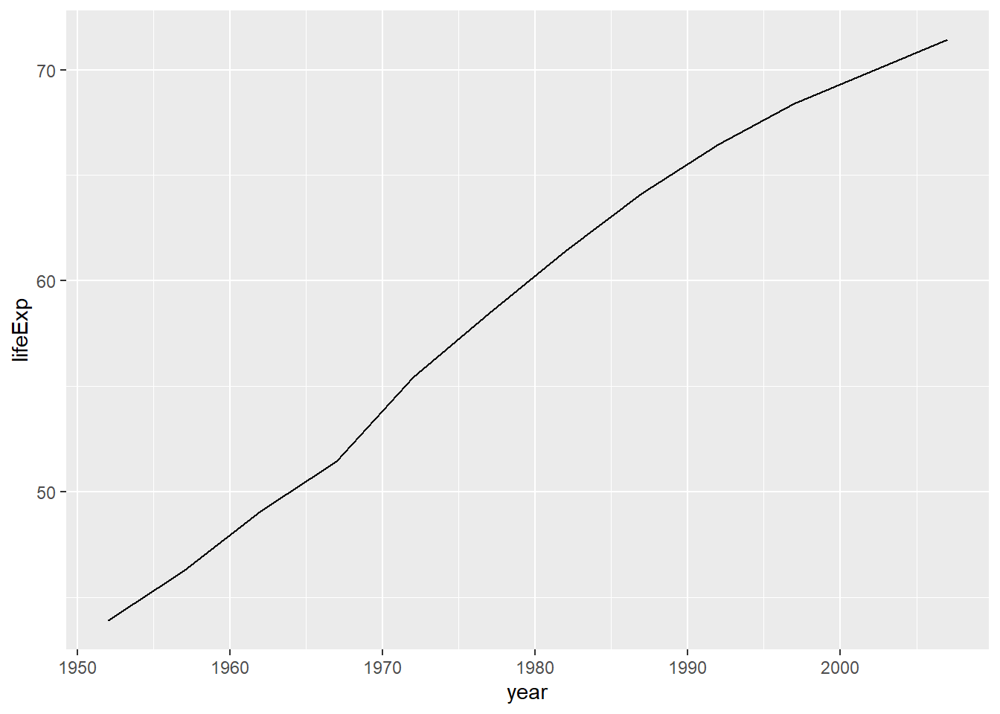


¿Cómo funciona la gramática? Anteriormente te habíamos mencionado que `ggplot` requiere tres componentes básicos para crear gráficos: los datos, el mapeo de variables y las figuras geométricas que representarán nuestros datos. 

En el código anterior: 

1. Le indicamos a la función `ggplot()` que nuestra *data* será `df_ejemplo`.
2. Con *mapping* le pedimos que mapee la variable `year` al eje *X* y la variable `lifeExp` al eje *Y*. 
3. Además de hacer esto, es necesario indicarle qué figura geométrica debe usar `ggplot` para representar nuestros datos. Esta instrucción se la indicamos con `geom_line()`, pidiendole que lo haga con una línea.

### ggplot conciso

Debido a que el primer argumento siempre será nuestra data, y en el mapeo de variables los dos primeros atributos siempre corresponden al eje *X* y al eje *Y*, podemos reescribir el código del gráfico anterior de forma más concisa.

Para estos parámetros tan comunes (`data`,`x`, `y`), no necesitamos especificar su nombre cada vez.


```r
ggplot(datos_peru, aes(year, lifeExp)) + 
  geom_line()
```


### Comparación


```r
ggplot(data = datos_peru, mapping = aes(x = year, y = lifeExp)) +
  geom_line()
```


```r
ggplot(datos_peru, aes(year, lifeExp)) + 
  geom_line()
```


## Almacenar gráfico

Los gráficos creados con `ggplot()` son un nuevo tipo de objeto. Como tal, puede usarse el operador de asignamiento (`<-`) para almacenarlos en nuestro ***Environment***. Por ejemplo, creamos el objeto `gráfico`.


```r
grafico <- ggplot(datos_peru, aes(year, lifeExp))
```

Ahora sólo haría falta agregarle una geometría. Para ello, hacemos uso del operador de adición (`+`). Mira lo fácil que es cambiar entre un gráfico de líneas, de columnas y de puntos.


```r
grafico +
    geom_line()
```


```r
grafico +
    geom_col()
```

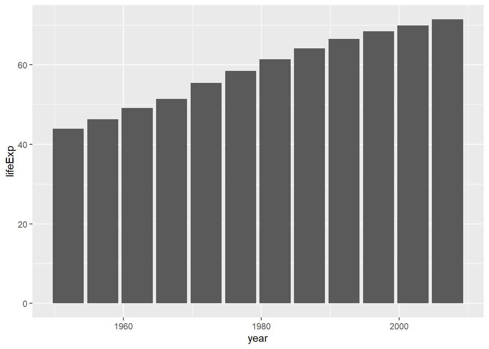


```r
grafico +
    geom_point()
```


¿Cómo determinar el correcto tipo de gráficos según los datos que tengo?

¿En qué casos debo usar columnas?¿En qué casos debo usar puntos?

## Los cinco gráficos nombrados

Con el fin de conseguir una explicación simple, nos limitamos a mostrar cinco tipos de gráfico que son de uso común y que además permiten entender los usos de la gramática en su forma básica.

### Gráfico de barras o columnas

El primer tipo de gráfico que veremos es el de barras. Resulta muy útil para mostrar estadísticas de resumen de nuestros datos categóricos. Por ejemplo, podemos ver cuántos países encontramos por continente en las observaciones de `gapminder` correspondientes al año 2002 y su promedio de expectativa de vida. Podemos obtener esa información usando funciones de `dplyr`.

Si queremos contar con columnas verticales, mapeamos nuestra variable discreta al eje X y nuestra variable numérica al eje Y.


```r
(paises_por_continente <- gapminder %>% 
  filter(year == 2002) %>% 
  group_by(continent) %>% 
  summarise(
    recuento = n(),
    promedio_exp = mean(lifeExp)
  ) %>% 
  ungroup())
#> # A tibble: 5 x 3
#>   continent recuento promedio_exp
#>   <fct>        <int>        <dbl>
#> 1 Africa          52         53.3
#> 2 Americas        25         72.4
#> 3 Asia            33         69.2
#> 4 Europe          30         76.7
#> 5 Oceania          2         79.7
```

Con esta información, podemos dibujar nuestro primer gráfico de barras haciendo uso de `geom_col()`.


```r
ggplot(paises_por_continente, aes(continent, recuento)) +
  geom_col()
```


### Gráfico de líneas

El siguiente tipo de gráfico ya lo conocemos. Consiste en líneas que nos sirven generalmente para analizar la evolución en el tiempo de determinadas variables. Debido a ello, es muy común mapear en el exe *X* alguna variable de tiempo, y en el eje *Y* alguna variable continua, que sería nuestra variable de interés. 

Con `gapminder` podemos analizar la evolución del PBI per cápita peruano de 1952 a 2007. Para ello filtraremos sólo las observaciones pertenecientes a Perú. Para generar el gráfico de líneas usamos `geom_line()`.


```r
ggplot(datos_peru, aes(year, gdpPercap)) +
  geom_line()
```

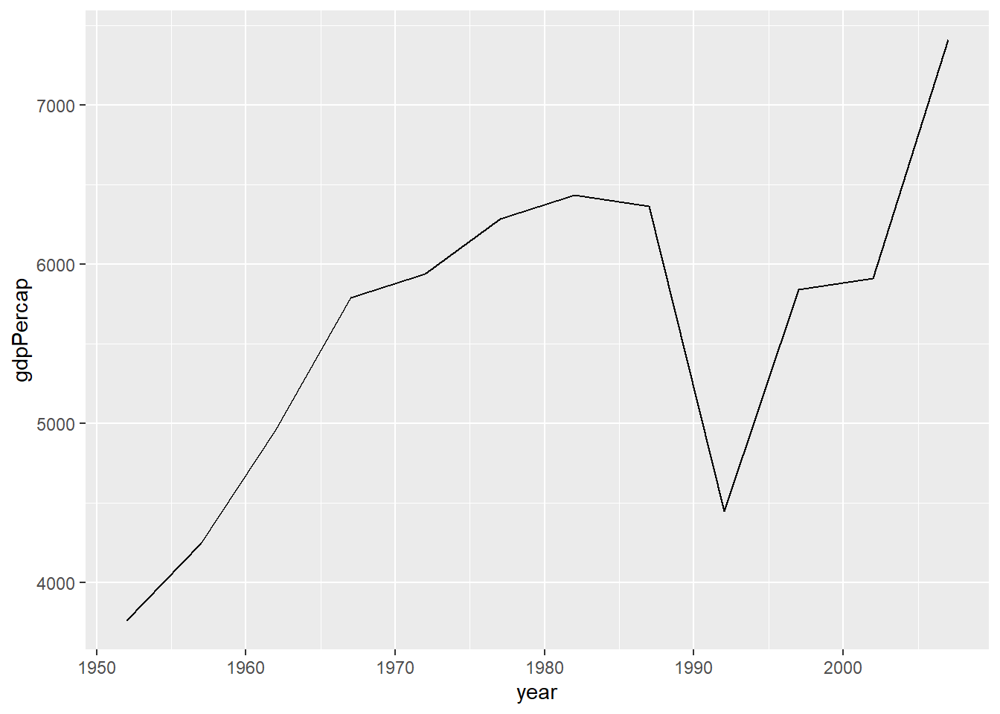


¿En qué periodo se ve una gran caída? ¿Cuántos años fueron necesarios para recuperar la misma cifra? Este tipo de preguntas son las que un gráfico de líneas nos permite revisar.

### Histogramas

Es posible hacer otro tipo de análisis usando una sola variable. El gráfico de columnas nos permitía ver cómo se distribuyen las observaciones de nuestras variables  discretas. Podemos esperar que exista un gráfico que nos muestre la distribución de variables continuas. 

Esto lo conseguimos con los histogramas. En lugar de mostrar la frecuencia de observaciones según *categorías*, nos permiten agrupar los datos por *intervalos*. Veamos cómo se distribuye el PBI per cápita de todos los países del mundo en el año 2007. Para generar el histograma usamos `geom_histogram()`. Por defecto, `ggplot()` divide nuestra data en 30 intervalos.


```r
datos_2007 <- filter(gapminder, year == 2007)
```

En este caso, sólo indicaremos la variable del eje X, porque el eje Y se calcula en base a los intervalos automáticos.


```r
ggplot(datos_2007, aes(gdpPercap)) +
  geom_histogram()
#> `stat_bin()` using `bins = 30`. Pick better value with
#> `binwidth`.
```


Con esto podemos responder alguna preguntas como:

- ¿Cuál es el valor más pequeño?¿Y el más alto?
- ¿Cuál es el valor "central" o "más típico"?
- ¿Qué tan dispersos están los valores?
- ¿Qué valores son muy frecuentes?¿Cuáles son infrecuentes?

### Diagramas de caja o boxplot

Otra manera de ver la distribución de nuestros valores es haciendo uso de diagramas de caja o *boxplot*. En este caso, es más entenderlo si primero hemos visto alguno. Para dibujarlo, usamos `geom_boxplot()`. 

Para obtener una *caja* que represente a todo nuestro conjunto de datos, sólo necesitamos especificar el eje X.


```r
ggplot(datos_2007, aes(gdpPercap)) +
  geom_boxplot()
```

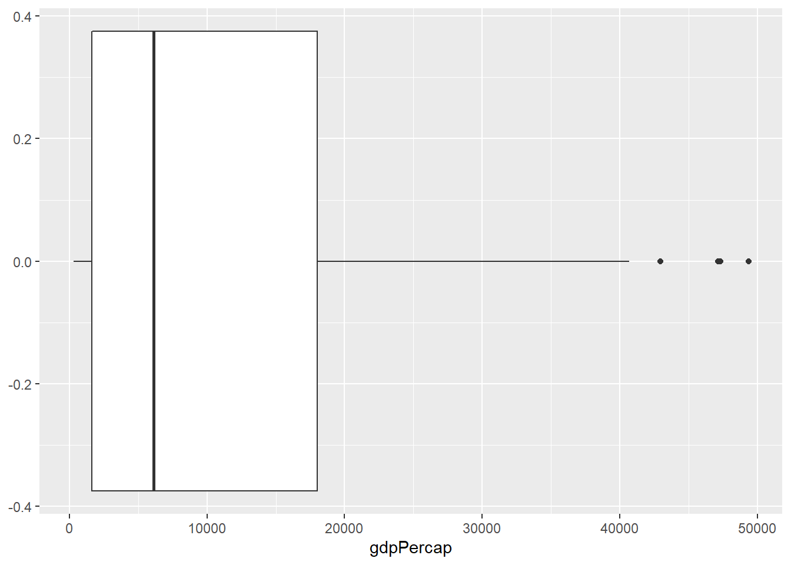


Vemos una especie de "caja" que busca representar nuestros valores. La línea negra remarcada al centro de la caja nos indica dónde encontramos el punto medio de nuestros datos (la mediana). Esta representación nos permite ubicar nuestros datos en cuatro segmentos importantes:

1. Todo lo que está "fuera" de la caja en el lado izquierdo representa el primer 25% de nuestros datos, también conocido como el primer cuartil o cuartil inferior. Son  los valores más bajos.
2. Todo lo que está en la primera mitad de la "caja" representa el segundo 25% de nuestros datos, conocido el segundo cuartil.
3. Todo lo que está en la segunda mitad de la "caja" representa el tercer 25% de nuestros datos, conocido como el tercer cuartil.
4. Todo lo que está "fuera" de la caja en el lado derecho, representa el cuarto 25% de nuestros datos, también conocido como el cuarto cuartil o cuartil superior. Son los valores más altos.


Habrás podido notar que además aparecen algunos puntos dibujados fuera de nuestros cuatro segmentos. Estos representan valores extremos, también conocidos como *outliers*. Pueden aparecer tanto en el lado más alto como en el más bajo de nuestros datos. Para determinar su existencia se utiliza un cálculo usando el Rango Intercuartil. Si no entiendes esta parte por ahora, no te preocupes, con que entiendas que son valores extremos es suficiente. 

Algo muy útil que nos permiten hacer los *boxplot* es comparar la distribución de nuestros valores entre diferentes categorías. Para ello, podemos mapear una variable discreta al eje Y. Por ejemplo, el PBI per cápita de los cinco continentes.


```r
ggplot(datos_2007, aes(gdpPercap, continent)) +
  geom_boxplot()
```

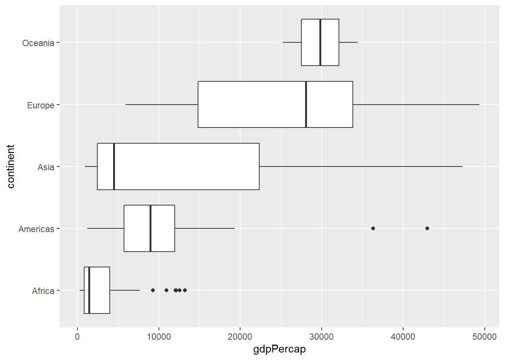


De esta manera, podemos ver que incluso los valores más altos de PBI en África no alcanzan a los valores medianos de Europa y Oceanía. También podemos ver que aunque Asia tiene países con valores de PBI per cápita comparables con los más altos de Europa, al menos la mitad de sus países se ubica en los niveles de África. 

### Diagrama de dispersión o puntos

Además de ver las características de una variable en particular, ya sea viendo su evolución en el tiempo o su distribución, podemos pensar en cómo analizar la relación *entre* nuestras variables. Por ejemplo, ¿qué relación existe entre el PBI per cápita y la expectativa de vida? Piensa un poco en esto y trata de responder la siguiente pregunta: ¿Existirá mayor expectativa de vida en países que tienen un PBI per cápita alto?

Para responder a esto podemos hacer uso de un diagrama de dispersión, también conocido como *diagrama de puntos*. Nos sirve para ver la relación existente entre dos variables continuas, también conocida como **correlación**. 


A continuación, analizaremos la relación entre el PBI per cápita y la expectativa de vida de todos los países en el año 2007. Para dibujar nuestro diagrama de puntos, hacemos uso de `geom_point()`. Las variables de interés van en cada uno de nuestros ejes. En este caso, como esperamos que el PBI per cápita influya en la epectativa de vida, lo colocamos en el eje *X*. Cada uno de los puntos de nuestro gráfico corresponde a un país. 


```r
ggplot(datos_2007, aes(gdpPercap, lifeExp)) +
  geom_point()
```


Algo que podemos notar rápidamente es que existen gran cantidad de países con un PBI per cápita bajo, esto hace que haya mucha aglomeración en esa parte del gráfico. Aunque esto nos dificulta un poco el análisis, podemos ir respondiendo la siguiente pregunta: ¿La expectativa de vida en los países con mayor PBI per cápita es alta o baja?

Para ver la distribución en los países con menor PBI per cápita podemos filtrar sólo los valores menores a 10000.


```r
datos_2007_filtrado <- filter(datos_2007, gdpPercap < 10000)
```


```r
ggplot(datos_2007_filtrado, aes(gdpPercap, lifeExp)) +
  geom_point()
```

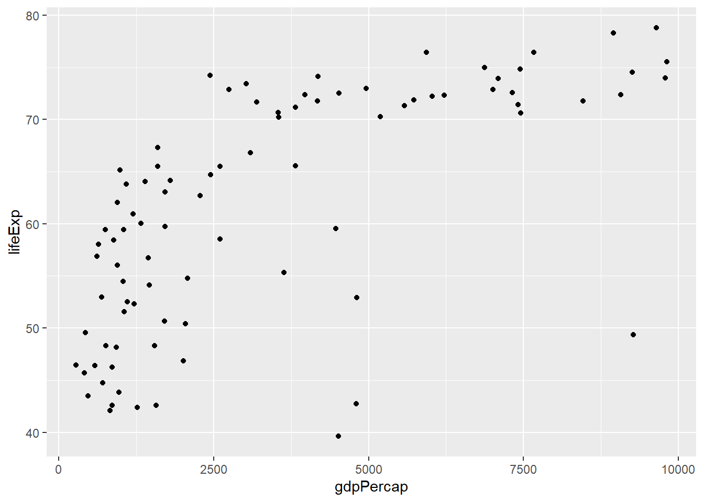

Nuevamente, podemos ver que los países con mayor PBI per cápita tienen la expectativa de vida más alta. Sin embargo, ahora además podemos ver con mayo claridad que aunque en los países con menor PBI per cápita la expectativa de vida es variada, generalmente se encuentra en los valores más bajos.


## Personalización de las geometrías

Hasta el momento hemos conocido cómo cambiar en nuestras geometrías los atributos estéticos de posición en los ejes *X* y *Y*. Sin embargo, cuando pensamos tradicionalmente en atributos estéticos, hay otro tipo de características que también nos vienen a la mente. 

Tres de ellas pueden ser el color, tamaño y forma de las figuras geométricas que utilizamos en nuestros gráficos. Con `ggplot2` podemos mapear alguna variable de nuestro set de datos a estos atributos.

### Color y relleno

Pensemos en un gráfico de barras. Habíamos visto que es posible crearlo usando `geom_bar()`. Por ejemplo, la cantidad de países en cada continente para el año 2007.


```r
ggplot(datos_2007, aes(continent)) +
  geom_bar()
```


El gráfico nos permite identificar una columna con cada uno de los continentes, pero para ello es necesario leer las etiquetas en el eje *X*. Otra manera de saber que estamos refiriéndonos a continentes distintos es haciendo uso del atributo `fill`, que se refiere al relleno de las barras.


```r
ggplot(datos_2007, aes(continent, fill = continent)) +
  geom_bar()
```

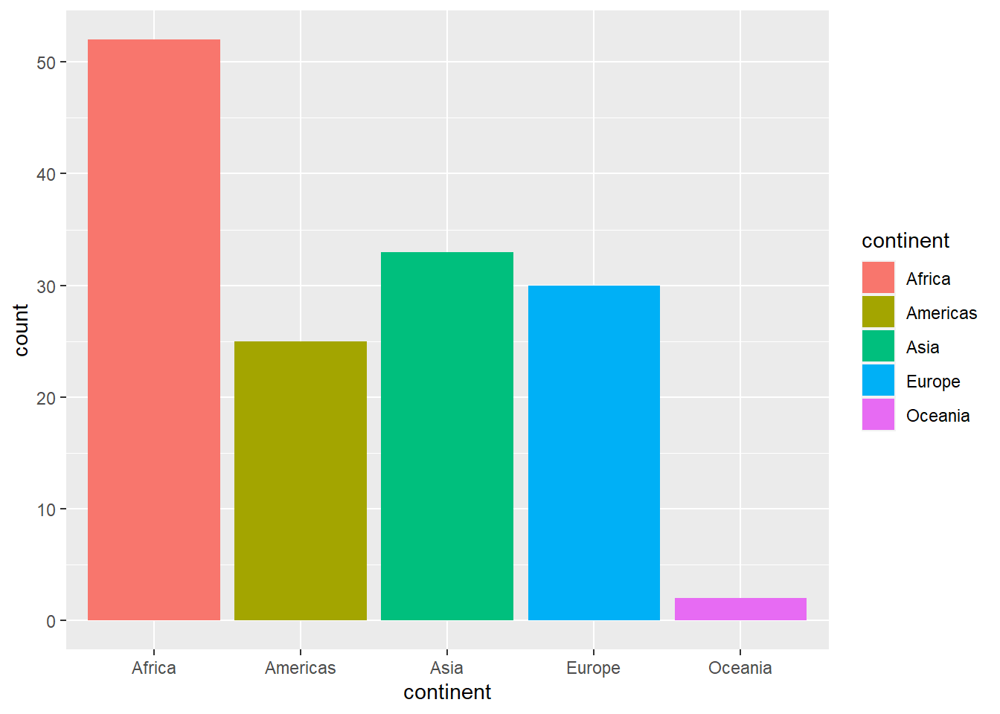

Vemos que además de colorear cada una de nuestras barras, `ggplot2` automáticamente le agrega una leyenda a nuestro  gráfico para saber qué categoría representa cada color mostrado. En un gráfico de barras, esta información ya la presentaban las etiquetas del eje *X*.

Para poder apreciar cómo el color nos puede apreciar a explotar nuestros datos, agreguémosle color de relleno a un diagrama de puntos. Recordemos que para ello hacemos uso de `geom_point()`. Por ejemplo, para ver la relación entre PBI per cápita y esperanza de vida en el año 2007. Haciendo uso del color, podemos ver cómo se posicionan los países según su continente.


```r
ggplot(datos_2007, aes(gdpPercap, lifeExp, color = continent)) +
  geom_point()
```


Podemos seguir viendo que existe una relación positiva entre PBI per cápita y expectativa de vida, pero además ahora podemos ver a qué continente pertenecen los países con PBI per cápita más alto y más bajo.

Sin embargo, te habrás dado cuenta que para el código de barras hemos usado el argumento `fill` pero en el diagrama de puntos hemos usado `color`. 

¿Por qué la diferencia? Tiene que ver con la figura geométrica que estamos utilizando. Por lo general debemos entenderlo de la siguiente manera:

- `fill`: permite modificar el relleno de la figura.
- `color`: permite modificar los bordes o líneas de la figura.

### Tamaño

Del mismo, usar el atributo de tamaño nos permite identificar nueva información acerca de nuestros datos. Por ejemplo, podemos ver la población de los países en nuestro diagrama de puntos para hacernos una idea de a quiénes representa. Para ello, usamos el argumento `size` y lo mapeamos a la variable `pop`.


```r
ggplot(datos_2007, aes(gdpPercap, lifeExp, size = pop)) +
  geom_point()
```

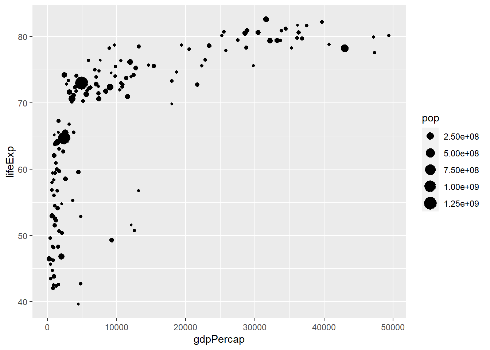


Nuevamente, `ggplot2` nos proporciona una leyenda automática. Así podemos ver que para el año 2007, los países con los valores de población más extremos, tienen un PBI per cápita bajo. Podemos combinar al mismo tiempo el uso de tamaño con el color para ver también la distribución según continentes. 


```r
ggplot(datos_2007, aes(gdpPercap, lifeExp, size = pop, color = continent)) +
  geom_point()
```

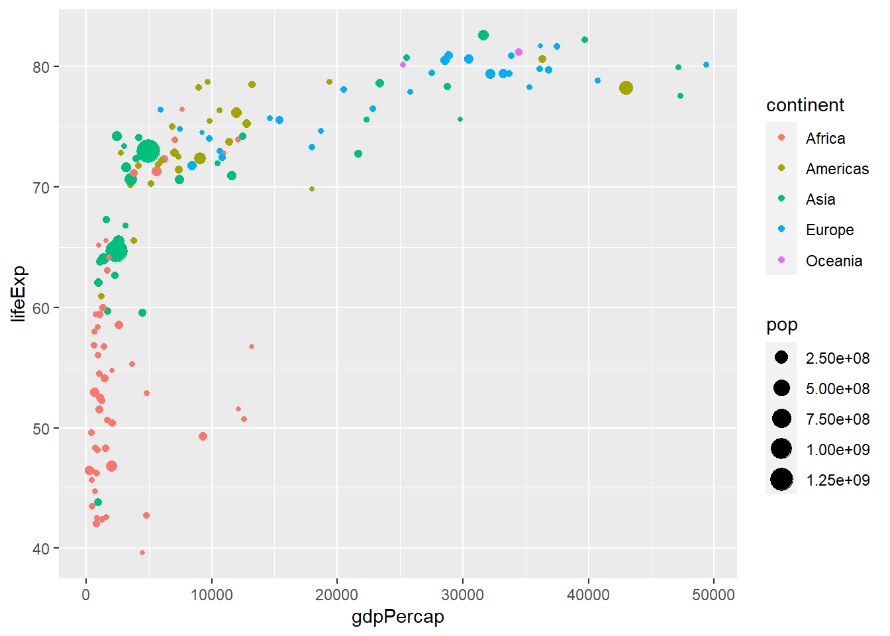


- ¿Qué punto crees que representa a China?
- ¿Qué punto crees que representa a EEUU?
- ¿Qué punto crees que representa a Australia?

### Forma

Debes tener en cuenta que no todo el mundo percibe los colores de la misma manera. En casos como esos, usar una forma distinta para nuestras categorías permite mostrar con mayor claridad las diferencias. Para ello, usamos el atributo `shape`.


```r
ggplot(datos_2007, aes(gdpPercap, lifeExp, shape = continent, color = continent)) +
  geom_point()
```


## Etiquetas

Por último, usar etiquetas significativas hará que nuestros gráficos hablen por sí solos. Para ello, agregamos la función `labs()` a nuestro gráfico. En ella, entre otras cosas, podemos modificar lo siguiente:

- `title`: el título principal de nuestro gráfico
- `subtitle`: el subtítulo del gráfico
- `caption`: la nota al pie de nuestro gráfico
- `x`: la etiqueta del eje *X*
- `y`: la etiqueta del eje *Y*

Conservamos `grafico_puntos` para usarlo como ejemplo.


```r
grafico_dispersion <- ggplot(datos_2007, aes(gdpPercap, lifeExp, shape = continent, color = continent)) +
  geom_point()
```


```r
grafico_dispersion
```

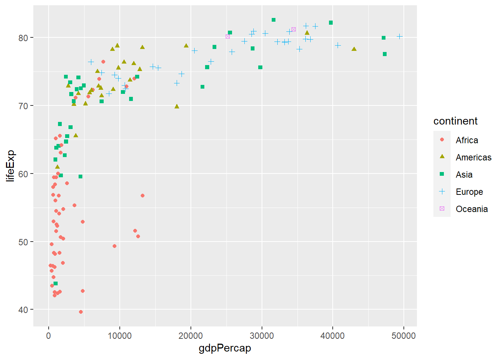

### Usando `labs()` para títulos


```r
grafico_dispersion +
  labs(title = "Relación entre PBI per cápita y expectativa de vida",
       subtitle = "Los cinco continentes en el año 2007")
```

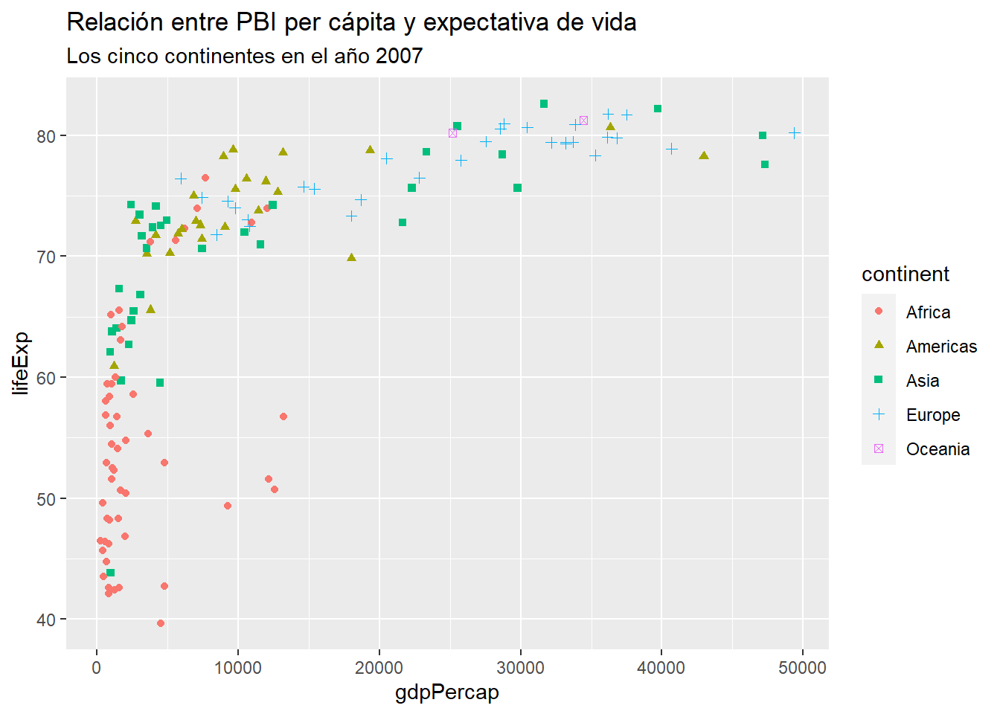

### Usando `labs()` para los ejes


```r
grafico_dispersion +
  labs(x = "PBI per cápita",
       y = "Expectativa de Vida")
```

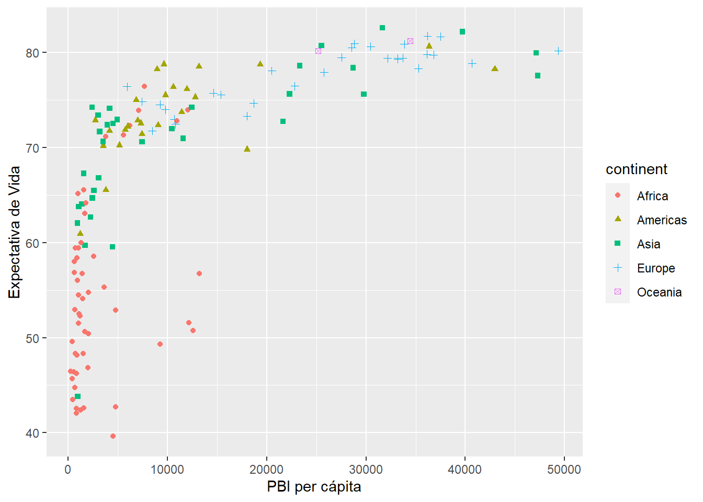

### Usando `labs()` para caption y leyenda


```r
grafico_dispersion +
  labs(caption = "Fuente: Proyecto gapminder",
       color = "Continente", shape = "Continente")
```

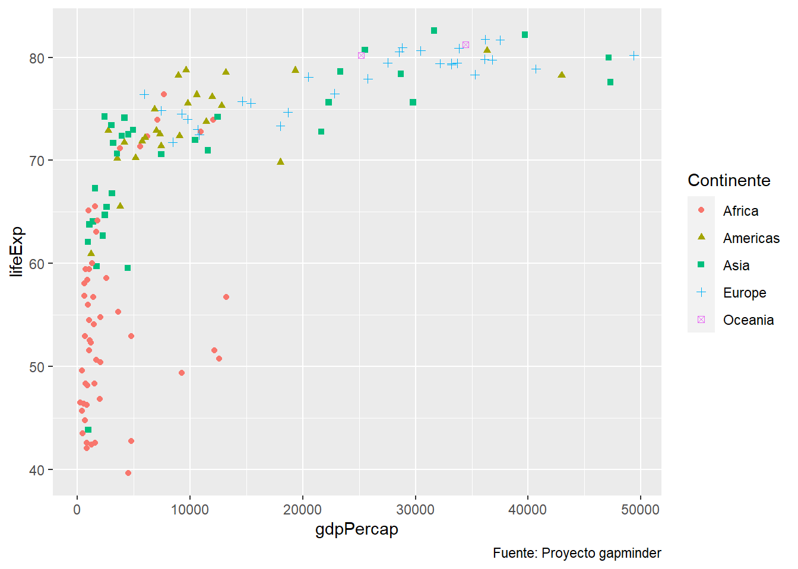

### Combinando todas las etiquetas

Podemos juntar todas las etiquetas dentro de una misma llamada a `labs()`. De paso, guardamos `grafico_final()` para usarlo más adelante.


```r
grafico_final <- grafico_dispersion +
  labs(title = "Relación entre PBI per cápita y expectativa de vida",
       subtitle = "Los cinco continentes en el año 2007",
       caption = "Fuente: Proyecto gapminder",
       x = "PBI per cápita",
       y = "Expectativa de Vida",
       color = "Continente",
       shape = "Continente")
```


```r
grafico_final
```


## Temas (theme)

Es probable que además de cambiar los colores, forma y etiquetas de un gráfico, busques modificar otros elementos estéticos que no corresponden a datos. 

Lamentablemente, escapa de la finalidad de esta sesión llegar a enseñarte esto. Sin embargo, `ggplot2` viene con temas predefinidos que te pueden permitir ahorrarte el trabajo de hacerlos por ti mismo. 

A continuación, algunos ejemplos de estos modelos aplicados a `grafico_final`.


```r
grafico_final +
    theme_bw()
```

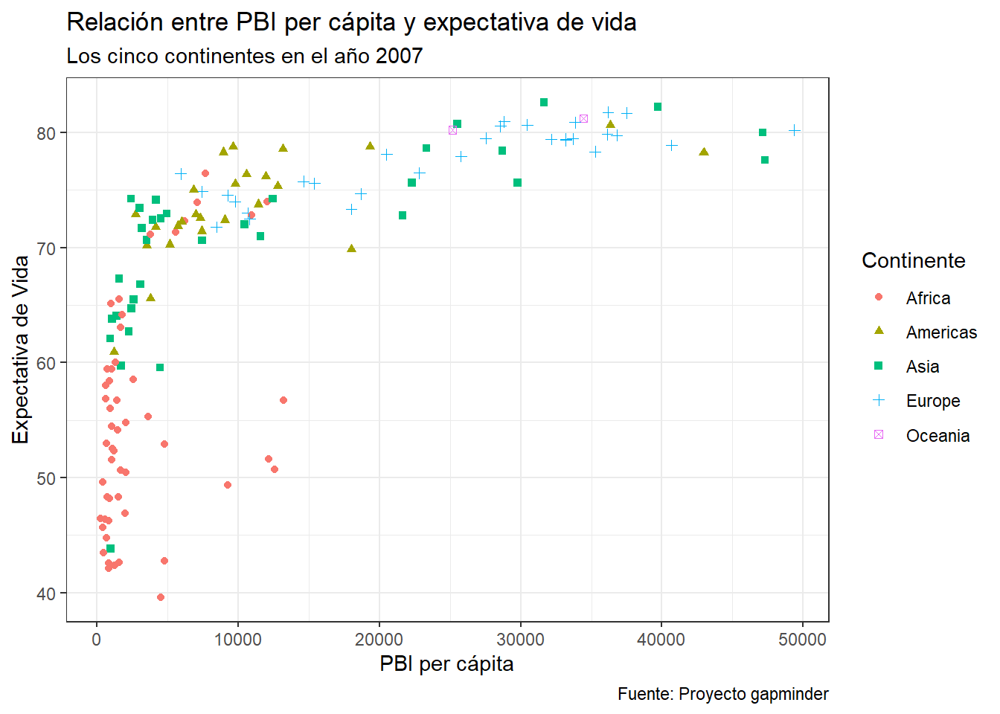


```r
grafico_final +
    theme_classic()
```


```r
grafico_final +
    theme_light()
```

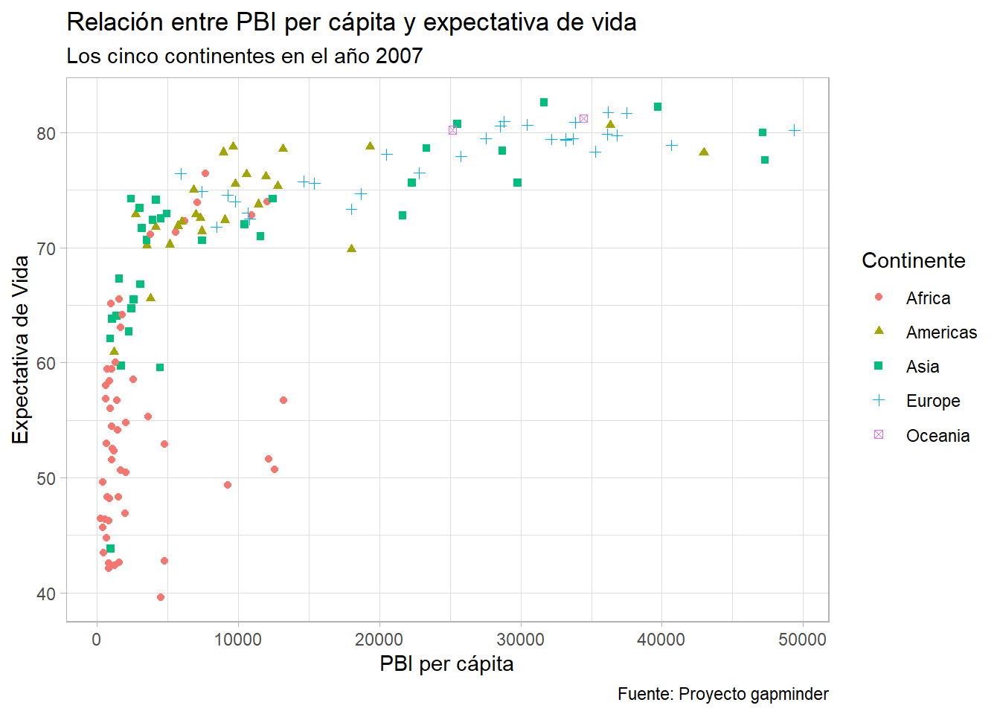


```r
grafico_final +
    theme_minimal()
```

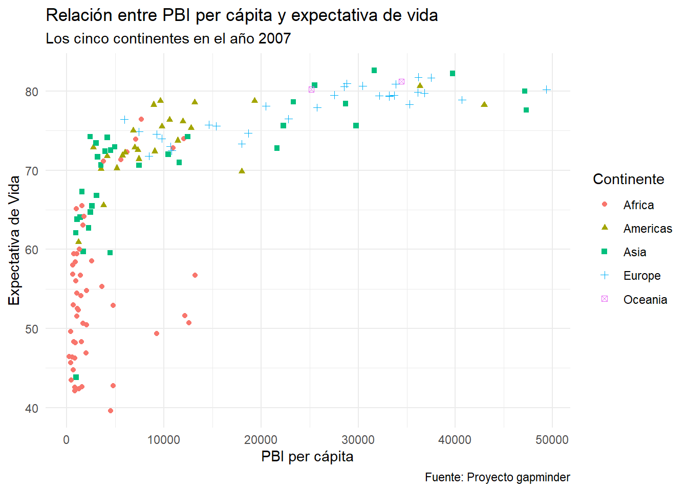


```r
grafico_final +
    theme_void()
```


### `ggthemes`

También existen otros paquetes que incluyen temas para gráficos. Uno de los más conocidos es `ggthemes`.

Para instalarlo.


```r
install.packages("ggthemes")
```

Una vez instalado, no olvides llamarlo con `library()` para usar sus temas.


```r
library(ggthemes)
```


```r
grafico_final +
    theme_base()
```

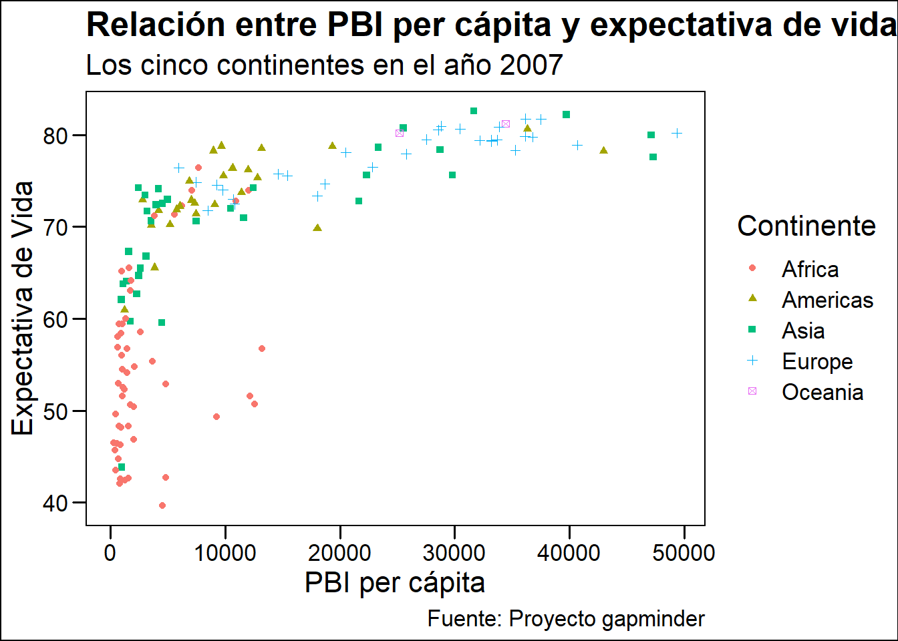


```r
grafico_final +
    theme_calc()
```

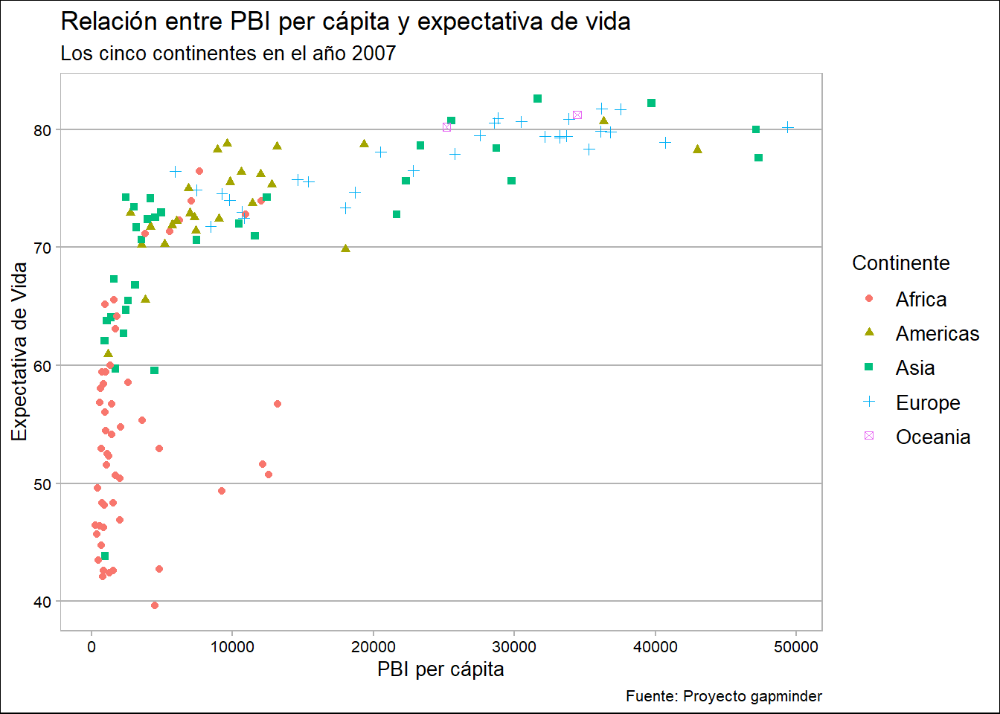


```r
grafico_final +
    theme_clean()
```

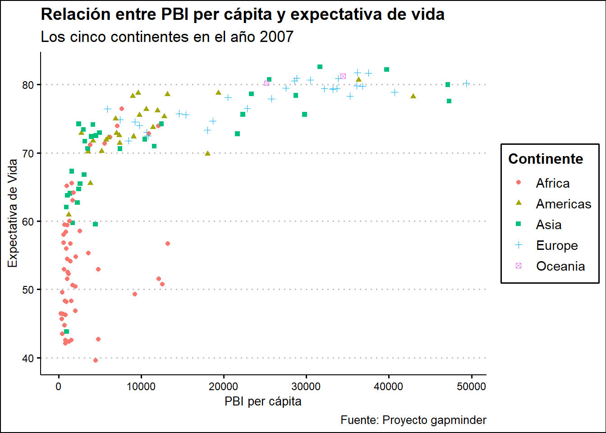


```r
grafico_final +
    theme_economist()
```

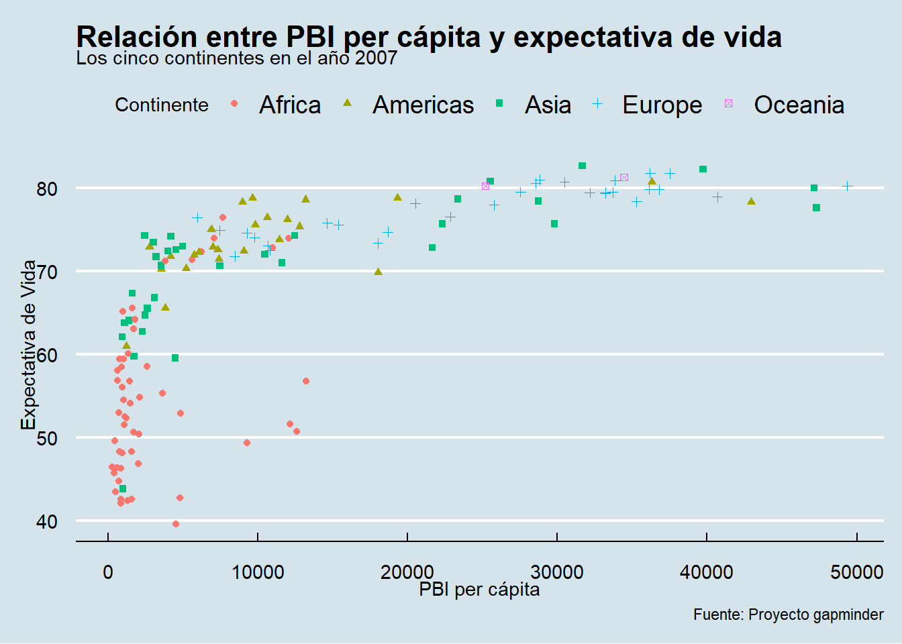


```r
grafico_final +
    theme_wsj()
```


```r
grafico_final +
    theme_stata()
```

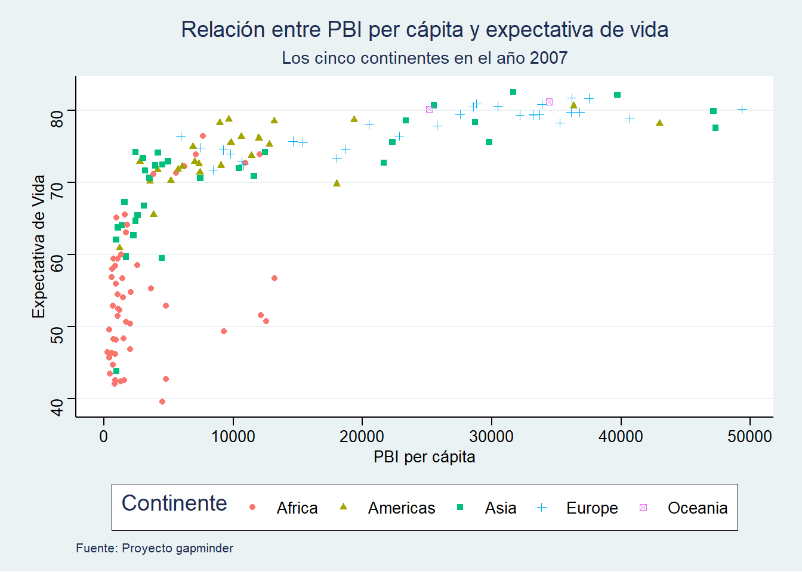

## Más allá de lo evidente

Si deseas conocer más sobre `ggplot2` puedes revisar su libro oficial y su "Cookbook" oficial.

- [Libro](https://ggplot2-book.org/index.html): Teoría y ejemplos claros
- [Cookbook](https://r-graphics.org/): Ejemplos extensivos
