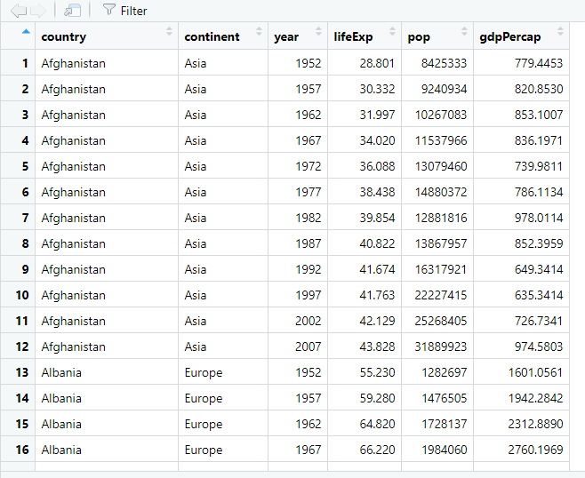

# Transformación

## Tibbles

Hasta el momento hemos trabajado usando tablas que hemos leído desde un paquete descargado o que hemos importado desde un archivo local. 

Por ejemplo, `gapminder`.

Cuando lo leemos, obtenemos un *tibble*.


```r
library(gapminder)

gapminder
#> # A tibble: 1,704 x 6
#>    country     continent  year lifeExp      pop gdpPercap
#>    <fct>       <fct>     <int>   <dbl>    <int>     <dbl>
#>  1 Afghanistan Asia       1952    28.8  8425333      779.
#>  2 Afghanistan Asia       1957    30.3  9240934      821.
#>  3 Afghanistan Asia       1962    32.0 10267083      853.
#>  4 Afghanistan Asia       1967    34.0 11537966      836.
#>  5 Afghanistan Asia       1972    36.1 13079460      740.
#>  6 Afghanistan Asia       1977    38.4 14880372      786.
#>  7 Afghanistan Asia       1982    39.9 12881816      978.
#>  8 Afghanistan Asia       1987    40.8 13867957      852.
#>  9 Afghanistan Asia       1992    41.7 16317921      649.
#> 10 Afghanistan Asia       1997    41.8 22227415      635.
#> # ... with 1,694 more rows
```

Un tibble es una tipo especial de tabla. R muestra un tibble en una manera sencilla: Se mostrarán solo las 10 primeras filas del tibble, así como todas las columnas que quepan en tu ventana de consola o documento R Markdown. R también agrega información útil acerca del tibble, como los tipos de datos de cada columna y el tamaño del conjunto de datos.

Los tibbles son una versión mejorada de los *data.frames*, la forma en que R trabaja con datos tabulares.

Los tibble son objetos ampliamente utilizados en la actualidad y son parte fundamental del [*tidyverse*](https://www.tidyverse.org/), un conjunto de paquetes que comparten una filosofía en común, con el fin de hacer el análisis de datos más accesible y reproducible. 

Esta filosofía es visiblemente respaldada por los desarrolladores de RStudio. Debido a esta popularidad , es bastante probable que cuando veas que alguien está hablando de un data.frame, en realidad se esté refiriendo a un tibble.


```r
library(tidyverse) # carga el paquete tibble
```


## Visualizar datos

Es posible acceder a una ventana de visualización de tablas en el panel de Edición si usamos la función `View()` en nuestra sesión de RStudio. Es el mismo panel que aparece cuando hacemos click en el nombre de una tabla en el *Environment*.


```r
View(gapminder)
```

{width=400px}

## El paquete `dplyr`

El paquete `dplyr` nos permite transformar nuestros datos tabulares. Una ventaja de este paquete es que sus funciones utilizan verbos para representar las acciones que queremos realizar en el contexto de nuestro análisis de datos. Por ejemplo:

- **Seleccionar** variables por su nombre con `select()`.
- **Filtrar** observaciones de acuerdo a sus valores con `filter()`.
- **Organizar** las filas de acuerdo a sus valores con `arrange()`.
- **Modificar** las variables de nuestro conjunto de datos con `mutate()`.
- **Resumir** nuestros datos en valores representativos con `summarise()`.
- **Agrupar** nuestros datos para operar en ellos con `group_by()`.

Otra característica de las funciones *verbo* de `dplyr` es que su primer argumento será siempre el *tibble* que queremos transformar. Más adelante, esto permitirá encadenar las funciones con el operador *pipe*.

Todas las operaciones descritas anteriormente pueden hacerse con funciones de *R base*, sin embargo no con una interfaz consistente entre funciones y paquetes.

Para poder usar sus funciones, debemos cargar el paquete. Como forma parte de los paquetes del tidyverse, podemos cargar todos juntos a la vez.


```r
# Para cargar sólo dplyr
library(dplyr)
#> 
#> Attaching package: 'dplyr'
#> The following objects are masked from 'package:stats':
#> 
#>     filter, lag
#> The following objects are masked from 'package:base':
#> 
#>     intersect, setdiff, setequal, union
```


```r
# Para cargar todo el tidyverse
library(tidyverse)
#> -- Attaching packages ------------------- tidyverse 1.3.1 --
#> v ggplot2 3.3.5     v purrr   0.3.4
#> v tibble  3.1.4     v dplyr   1.0.7
#> v tidyr   1.1.4     v stringr 1.4.0
#> v readr   2.0.2     v forcats 0.5.1
#> -- Conflicts ---------------------- tidyverse_conflicts() --
#> x dplyr::filter() masks stats::filter()
#> x dplyr::lag()    masks stats::lag()
```

## Transformación de columnas

### Cambiar nombre de una columna

Usar `rename()`.

Esta función nos permite cambiar el nombre de nuestras columnas. Debemos especificar:

1. El nombre del conjunto de datos
2. El cambio de nombre, usando la sintaxis `nuevo_nombre = nombre_anterior`


```r
gapminder %>% 
    rename(pais = country)
#> # A tibble: 1,704 x 6
#>    pais        continent  year lifeExp      pop gdpPercap
#>    <fct>       <fct>     <int>   <dbl>    <int>     <dbl>
#>  1 Afghanistan Asia       1952    28.8  8425333      779.
#>  2 Afghanistan Asia       1957    30.3  9240934      821.
#>  3 Afghanistan Asia       1962    32.0 10267083      853.
#>  4 Afghanistan Asia       1967    34.0 11537966      836.
#>  5 Afghanistan Asia       1972    36.1 13079460      740.
#>  6 Afghanistan Asia       1977    38.4 14880372      786.
#>  7 Afghanistan Asia       1982    39.9 12881816      978.
#>  8 Afghanistan Asia       1987    40.8 13867957      852.
#>  9 Afghanistan Asia       1992    41.7 16317921      649.
#> 10 Afghanistan Asia       1997    41.8 22227415      635.
#> # ... with 1,694 more rows
```

### Cambiar nombre de varias columnas

Es posible cambiar más de un nombre a la vez.


```r
gapminder %>% 
    rename(pais = country,
           continente = continent, 
           anio = year,
           exp_de_vida = lifeExp,
           poblacion = pop,
           pbi_per_cap = gdpPercap)
#> # A tibble: 1,704 x 6
#>    pais        continente  anio exp_de_vida poblacion pbi_per_cap
#>    <fct>       <fct>      <int>       <dbl>     <int>       <dbl>
#>  1 Afghanistan Asia        1952        28.8   8425333        779.
#>  2 Afghanistan Asia        1957        30.3   9240934        821.
#>  3 Afghanistan Asia        1962        32.0  10267083        853.
#>  4 Afghanistan Asia        1967        34.0  11537966        836.
#>  5 Afghanistan Asia        1972        36.1  13079460        740.
#>  6 Afghanistan Asia        1977        38.4  14880372        786.
#>  7 Afghanistan Asia        1982        39.9  12881816        978.
#>  8 Afghanistan Asia        1987        40.8  13867957        852.
#>  9 Afghanistan Asia        1992        41.7  16317921        649.
#> 10 Afghanistan Asia        1997        41.8  22227415        635.
#> # ... with 1,694 more rows
```

### Cambiar posición de una columna

Usar `relocate()`.

Esta función permite cambiar la ubicación de nuestras columnas. Debemos especificar:

1. El nombre del conjunto de datos
2. Los nombres de columna que queremos reubicar


Por defecto, pondrá las columnas especificadas como primera columna.


```r
gapminder %>% 
    relocate(gdpPercap)
#> # A tibble: 1,704 x 6
#>    gdpPercap country     continent  year lifeExp      pop
#>        <dbl> <fct>       <fct>     <int>   <dbl>    <int>
#>  1      779. Afghanistan Asia       1952    28.8  8425333
#>  2      821. Afghanistan Asia       1957    30.3  9240934
#>  3      853. Afghanistan Asia       1962    32.0 10267083
#>  4      836. Afghanistan Asia       1967    34.0 11537966
#>  5      740. Afghanistan Asia       1972    36.1 13079460
#>  6      786. Afghanistan Asia       1977    38.4 14880372
#>  7      978. Afghanistan Asia       1982    39.9 12881816
#>  8      852. Afghanistan Asia       1987    40.8 13867957
#>  9      649. Afghanistan Asia       1992    41.7 16317921
#> 10      635. Afghanistan Asia       1997    41.8 22227415
#> # ... with 1,694 more rows
```

---

Es posible especificar una posición en especial con los argumentos `.before` (antes) o `.after` (después).


```r
gapminder %>% 
    relocate(gdpPercap, .before = year)
#> # A tibble: 1,704 x 6
#>    country     continent gdpPercap  year lifeExp      pop
#>    <fct>       <fct>         <dbl> <int>   <dbl>    <int>
#>  1 Afghanistan Asia           779.  1952    28.8  8425333
#>  2 Afghanistan Asia           821.  1957    30.3  9240934
#>  3 Afghanistan Asia           853.  1962    32.0 10267083
#>  4 Afghanistan Asia           836.  1967    34.0 11537966
#>  5 Afghanistan Asia           740.  1972    36.1 13079460
#>  6 Afghanistan Asia           786.  1977    38.4 14880372
#>  7 Afghanistan Asia           978.  1982    39.9 12881816
#>  8 Afghanistan Asia           852.  1987    40.8 13867957
#>  9 Afghanistan Asia           649.  1992    41.7 16317921
#> 10 Afghanistan Asia           635.  1997    41.8 22227415
#> # ... with 1,694 more rows
```


```r
gapminder %>% 
    relocate(gdpPercap, .after = year)
#> # A tibble: 1,704 x 6
#>    country     continent  year gdpPercap lifeExp      pop
#>    <fct>       <fct>     <int>     <dbl>   <dbl>    <int>
#>  1 Afghanistan Asia       1952      779.    28.8  8425333
#>  2 Afghanistan Asia       1957      821.    30.3  9240934
#>  3 Afghanistan Asia       1962      853.    32.0 10267083
#>  4 Afghanistan Asia       1967      836.    34.0 11537966
#>  5 Afghanistan Asia       1972      740.    36.1 13079460
#>  6 Afghanistan Asia       1977      786.    38.4 14880372
#>  7 Afghanistan Asia       1982      978.    39.9 12881816
#>  8 Afghanistan Asia       1987      852.    40.8 13867957
#>  9 Afghanistan Asia       1992      649.    41.7 16317921
#> 10 Afghanistan Asia       1997      635.    41.8 22227415
#> # ... with 1,694 more rows
```

### Seleccionar columnas

La función `select()` nos permite seleccionar columnas específicas de nuestro  tibble Supongamos que sólo queremos los nombres de los países, el año y el total de población. Podemos hacerlo con `select()`.

Debemos especificar:

1. El nombre del conjunto de datos
2. Las variables a escoger

Las columnas escogidas aparecen en el orden especificado.


```r
gapminder %>% 
    select(country, year, pop)
#> # A tibble: 1,704 x 3
#>    country      year      pop
#>    <fct>       <int>    <int>
#>  1 Afghanistan  1952  8425333
#>  2 Afghanistan  1957  9240934
#>  3 Afghanistan  1962 10267083
#>  4 Afghanistan  1967 11537966
#>  5 Afghanistan  1972 13079460
#>  6 Afghanistan  1977 14880372
#>  7 Afghanistan  1982 12881816
#>  8 Afghanistan  1987 13867957
#>  9 Afghanistan  1992 16317921
#> 10 Afghanistan  1997 22227415
#> # ... with 1,694 more rows
```

También es posible escoger columnas usando su posición en el conjunto de datos con números.


```r
gapminder %>% 
    select(1, 3, 5)
#> # A tibble: 1,704 x 3
#>    country      year      pop
#>    <fct>       <int>    <int>
#>  1 Afghanistan  1952  8425333
#>  2 Afghanistan  1957  9240934
#>  3 Afghanistan  1962 10267083
#>  4 Afghanistan  1967 11537966
#>  5 Afghanistan  1972 13079460
#>  6 Afghanistan  1977 14880372
#>  7 Afghanistan  1982 12881816
#>  8 Afghanistan  1987 13867957
#>  9 Afghanistan  1992 16317921
#> 10 Afghanistan  1997 22227415
#> # ... with 1,694 more rows
```

Sin embargo, no recomiendo usar esta manera de selección porque el código es más dificil de interpretar.

### Remover columnas

Anteponerle el signo negativo al nombre de la columna en `select()`. En este ejemplo queremos dejar fuera la columna `pop` y `lifeExp`.


```r
gapminder %>% 
    select(-pop, -lifeExp)
#> # A tibble: 1,704 x 4
#>    country     continent  year gdpPercap
#>    <fct>       <fct>     <int>     <dbl>
#>  1 Afghanistan Asia       1952      779.
#>  2 Afghanistan Asia       1957      821.
#>  3 Afghanistan Asia       1962      853.
#>  4 Afghanistan Asia       1967      836.
#>  5 Afghanistan Asia       1972      740.
#>  6 Afghanistan Asia       1977      786.
#>  7 Afghanistan Asia       1982      978.
#>  8 Afghanistan Asia       1987      852.
#>  9 Afghanistan Asia       1992      649.
#> 10 Afghanistan Asia       1997      635.
#> # ... with 1,694 more rows
```


### Cambiar nombres en selección

Usando `select()` con una sintaxis como la de `rename()` para cambiar el nombre de las columnas al mismo tiempo que seleccionarlas.


```r
gapminder %>% 
    select(pais = country, 
           anio = year,
           poblacion = pop)
#> # A tibble: 1,704 x 3
#>    pais         anio poblacion
#>    <fct>       <int>     <int>
#>  1 Afghanistan  1952   8425333
#>  2 Afghanistan  1957   9240934
#>  3 Afghanistan  1962  10267083
#>  4 Afghanistan  1967  11537966
#>  5 Afghanistan  1972  13079460
#>  6 Afghanistan  1977  14880372
#>  7 Afghanistan  1982  12881816
#>  8 Afghanistan  1987  13867957
#>  9 Afghanistan  1992  16317921
#> 10 Afghanistan  1997  22227415
#> # ... with 1,694 more rows
```

El código anterior es equivalente a combinar ambas operaciones.


```r
gapminder %>% 
    select(country, year, pop) %>% 
    rename(pais = country,
           anio = year,
           poblacion = pop)
#> # A tibble: 1,704 x 3
#>    pais         anio poblacion
#>    <fct>       <int>     <int>
#>  1 Afghanistan  1952   8425333
#>  2 Afghanistan  1957   9240934
#>  3 Afghanistan  1962  10267083
#>  4 Afghanistan  1967  11537966
#>  5 Afghanistan  1972  13079460
#>  6 Afghanistan  1977  14880372
#>  7 Afghanistan  1982  12881816
#>  8 Afghanistan  1987  13867957
#>  9 Afghanistan  1992  16317921
#> 10 Afghanistan  1997  22227415
#> # ... with 1,694 more rows
```


### Opciones avanzadas de selección

La función `select()` puede hacer uso de funciones de apoyo del paquete `tidyselect()`, que se cargan automáticamente junto con `dplyr`.

Para ejemplificar, usaremos el conjunto de datos `flights` del paquete `nycflights13`.

---


```r
library(nycflights13)

flights
#> # A tibble: 336,776 x 19
#>     year month   day dep_time sched_dep_time dep_delay
#>    <int> <int> <int>    <int>          <int>     <dbl>
#>  1  2013     1     1      517            515         2
#>  2  2013     1     1      533            529         4
#>  3  2013     1     1      542            540         2
#>  4  2013     1     1      544            545        -1
#>  5  2013     1     1      554            600        -6
#>  6  2013     1     1      554            558        -4
#>  7  2013     1     1      555            600        -5
#>  8  2013     1     1      557            600        -3
#>  9  2013     1     1      557            600        -3
#> 10  2013     1     1      558            600        -2
#> # ... with 336,766 more rows, and 13 more variables:
#> #   arr_time <int>, sched_arr_time <int>, arr_delay <dbl>,
#> #   carrier <chr>, flight <int>, tailnum <chr>,
#> #   origin <chr>, dest <chr>, air_time <dbl>,
#> #   distance <dbl>, hour <dbl>, minute <dbl>,
#> #   time_hour <dttm>
```

#### Seleccionar columnas en secuencia

Es posible seleccionar una secuencia de variables consecutivas si usamos el operador de secuencia (`:`).


```r
flights %>% 
    select(dep_time:sched_arr_time)
#> # A tibble: 336,776 x 5
#>    dep_time sched_dep_time dep_delay arr_time sched_arr_time
#>       <int>          <int>     <dbl>    <int>          <int>
#>  1      517            515         2      830            819
#>  2      533            529         4      850            830
#>  3      542            540         2      923            850
#>  4      544            545        -1     1004           1022
#>  5      554            600        -6      812            837
#>  6      554            558        -4      740            728
#>  7      555            600        -5      913            854
#>  8      557            600        -3      709            723
#>  9      557            600        -3      838            846
#> 10      558            600        -2      753            745
#> # ... with 336,766 more rows
```

#### Seleccionar columnas según un patrón 

Es posible usar funciones que nos permiten hacer *match* de los nombres de nuestras columnas con caracteres de texto:

- `starts_with()`: El nombre empieza con un prefijo determinado
- `ends_with()`: El nombre termina con un sufijo determinado
- `contains()`: El nombre contiene una cadena de texto
- `matches()`: El nombre hace *match* con una *expresión regular* (avanzado)

Los patrones de texto deben especificarse entre comillas (`"`).


```r
flights %>% 
    select(starts_with("dep"))
#> # A tibble: 336,776 x 2
#>    dep_time dep_delay
#>       <int>     <dbl>
#>  1      517         2
#>  2      533         4
#>  3      542         2
#>  4      544        -1
#>  5      554        -6
#>  6      554        -4
#>  7      555        -5
#>  8      557        -3
#>  9      557        -3
#> 10      558        -2
#> # ... with 336,766 more rows
```


```r
flights %>% 
    select(ends_with("delay"))
#> # A tibble: 336,776 x 2
#>    dep_delay arr_delay
#>        <dbl>     <dbl>
#>  1         2        11
#>  2         4        20
#>  3         2        33
#>  4        -1       -18
#>  5        -6       -25
#>  6        -4        12
#>  7        -5        19
#>  8        -3       -14
#>  9        -3        -8
#> 10        -2         8
#> # ... with 336,766 more rows
```


```r
flights %>% 
    select(contains("time"))
#> # A tibble: 336,776 x 6
#>    dep_time sched_dep_time arr_time sched_arr_time air_time
#>       <int>          <int>    <int>          <int>    <dbl>
#>  1      517            515      830            819      227
#>  2      533            529      850            830      227
#>  3      542            540      923            850      160
#>  4      544            545     1004           1022      183
#>  5      554            600      812            837      116
#>  6      554            558      740            728      150
#>  7      555            600      913            854      158
#>  8      557            600      709            723       53
#>  9      557            600      838            846      140
#> 10      558            600      753            745      138
#> # ... with 336,766 more rows, and 1 more variable:
#> #   time_hour <dttm>
```


```r
flights %>% 
    select(matches("a(i|r)r_time"))
#> # A tibble: 336,776 x 3
#>    arr_time sched_arr_time air_time
#>       <int>          <int>    <dbl>
#>  1      830            819      227
#>  2      850            830      227
#>  3      923            850      160
#>  4     1004           1022      183
#>  5      812            837      116
#>  6      740            728      150
#>  7      913            854      158
#>  8      709            723       53
#>  9      838            846      140
#> 10      753            745      138
#> # ... with 336,766 more rows
```

#### Seleccionar avanzado simultáneo

Es posible combinar todas las formas de selección dentro de una sola llamada a `select()`.


```r
flights %>% 
    select(year:day, starts_with("arr"))
#> # A tibble: 336,776 x 5
#>     year month   day arr_time arr_delay
#>    <int> <int> <int>    <int>     <dbl>
#>  1  2013     1     1      830        11
#>  2  2013     1     1      850        20
#>  3  2013     1     1      923        33
#>  4  2013     1     1     1004       -18
#>  5  2013     1     1      812       -25
#>  6  2013     1     1      740        12
#>  7  2013     1     1      913        19
#>  8  2013     1     1      709       -14
#>  9  2013     1     1      838        -8
#> 10  2013     1     1      753         8
#> # ... with 336,766 more rows
```

## Transformación filas

### Obtener un subconjunto de datos

La función `filter()` nos simplifica la tarea de hacer *subsetting* (escoger un subconjunto de nuestros datos). Debemos especificar dos elementos:

1. El nombre del conjunto de datos
2. La condición que tiene cumplir una observación para permanecer.

Para establecer las condiciones, debemos usar operaciones lógicas. Del mismo modo que los operadores aritméticos nos permiten obtener un resultado aritmético (*aka*, numérico) en nuestros cálculos, existen otros operadores que nos permiten obtener resultados lógicos.

En esta sección, usaremos `gapminder` como ejemplo.

#### Operadores relacionales

Los primeros de ellos son los relacionales, y ya los conocemos desde el colegio, pero es bueno saber cómo escribirlos en R. La siguiente tabla nos muestra para qué sirve cada uno de ellos.

|Operador|Uso              |
|-------:|:----------------|
|`==`    |Igual que        |
|`!=`    |Diferente que    |
|`>`     |Mayor que        |
|`<`     |Menor que        |
|`>=`    |Mayor o igual que|
|`<=`    |Menor o igual que|

#### Subsetting basado en un solo valor

De entre todas las observaciones, podemos escoger aquellas cuyo país sea "Perú". Para ello, usamos la operación `country == "Peru"`.


```r
gapminder %>% 
    filter(country == "Peru")
#> # A tibble: 12 x 6
#>    country continent  year lifeExp      pop gdpPercap
#>    <fct>   <fct>     <int>   <dbl>    <int>     <dbl>
#>  1 Peru    Americas   1952    43.9  8025700     3759.
#>  2 Peru    Americas   1957    46.3  9146100     4245.
#>  3 Peru    Americas   1962    49.1 10516500     4957.
#>  4 Peru    Americas   1967    51.4 12132200     5788.
#>  5 Peru    Americas   1972    55.4 13954700     5938.
#>  6 Peru    Americas   1977    58.4 15990099     6281.
#>  7 Peru    Americas   1982    61.4 18125129     6435.
#>  8 Peru    Americas   1987    64.1 20195924     6361.
#>  9 Peru    Americas   1992    66.5 22430449     4446.
#> 10 Peru    Americas   1997    68.4 24748122     5838.
#> 11 Peru    Americas   2002    69.9 26769436     5909.
#> 12 Peru    Americas   2007    71.4 28674757     7409.
```

También podemos hacer comparaciones basadas en números. Por ejemplo, todas las observaciones correspondientes al año 2007.


```r
gapminder %>% 
    filter(year == 2007)
#> # A tibble: 142 x 6
#>    country     continent  year lifeExp       pop gdpPercap
#>    <fct>       <fct>     <int>   <dbl>     <int>     <dbl>
#>  1 Afghanistan Asia       2007    43.8  31889923      975.
#>  2 Albania     Europe     2007    76.4   3600523     5937.
#>  3 Algeria     Africa     2007    72.3  33333216     6223.
#>  4 Angola      Africa     2007    42.7  12420476     4797.
#>  5 Argentina   Americas   2007    75.3  40301927    12779.
#>  6 Australia   Oceania    2007    81.2  20434176    34435.
#>  7 Austria     Europe     2007    79.8   8199783    36126.
#>  8 Bahrain     Asia       2007    75.6    708573    29796.
#>  9 Bangladesh  Asia       2007    64.1 150448339     1391.
#> 10 Belgium     Europe     2007    79.4  10392226    33693.
#> # ... with 132 more rows
```

Podemos escoger sólo aquellas observaciones que cuya población sea mayor a mil millones.


```r
gapminder %>% 
    filter(pop > 1000000000)
#> # A tibble: 8 x 6
#>   country continent  year lifeExp        pop gdpPercap
#>   <fct>   <fct>     <int>   <dbl>      <int>     <dbl>
#> 1 China   Asia       1982    65.5 1000281000      962.
#> 2 China   Asia       1987    67.3 1084035000     1379.
#> 3 China   Asia       1992    68.7 1164970000     1656.
#> 4 China   Asia       1997    70.4 1230075000     2289.
#> 5 China   Asia       2002    72.0 1280400000     3119.
#> 6 China   Asia       2007    73.0 1318683096     4959.
#> 7 India   Asia       2002    62.9 1034172547     1747.
#> 8 India   Asia       2007    64.7 1110396331     2452.
```

Podemos escoger las observaciones cuya expectativa de vida sea menor a 30 años.


```r
gapminder %>% 
    filter(lifeExp < 30)
#> # A tibble: 2 x 6
#>   country     continent  year lifeExp     pop gdpPercap
#>   <fct>       <fct>     <int>   <dbl>   <int>     <dbl>
#> 1 Afghanistan Asia       1952    28.8 8425333      779.
#> 2 Rwanda      Africa     1992    23.6 7290203      737.
```

#### Subsetting basado en múltiples valores

Si usamos más de una condición, sólo permanecerán aquellas que cumplan con todas las expuestas. Por ejemplo, observaciones donde la población sea mayor a mil millones y la expectativa de vida mayor a 70 años.


```r
gapminder %>% 
    filter(pop > 1000000000, lifeExp > 70)
#> # A tibble: 3 x 6
#>   country continent  year lifeExp        pop gdpPercap
#>   <fct>   <fct>     <int>   <dbl>      <int>     <dbl>
#> 1 China   Asia       1997    70.4 1230075000     2289.
#> 2 China   Asia       2002    72.0 1280400000     3119.
#> 3 China   Asia       2007    73.0 1318683096     4959.
```

Países de América a partir del 2002 cuyo PBI per cápita fue mayor a $15000.


```r
gapminder %>% 
    filter(continent == "Americas", year >= 2002, gdpPercap > 15000)
#> # A tibble: 7 x 6
#>   country             continent  year lifeExp    pop gdpPercap
#>   <fct>               <fct>     <int>   <dbl>  <int>     <dbl>
#> 1 Canada              Americas   2002    79.8 3.19e7    33329.
#> 2 Canada              Americas   2007    80.7 3.34e7    36319.
#> 3 Puerto Rico         Americas   2002    77.8 3.86e6    18856.
#> 4 Puerto Rico         Americas   2007    78.7 3.94e6    19329.
#> 5 Trinidad and Tobago Americas   2007    69.8 1.06e6    18009.
#> 6 United States       Americas   2002    77.3 2.88e8    39097.
#> 7 United States       Americas   2007    78.2 3.01e8    42952.
```

#### Operadores lógicos

Para potenciar nuestras habilidades de comparación, podemos hacer uso de operadores lógicos. La siguiente tabla te muestra cuáles son:

|Operador|Uso      |
|-------:|:--------|
|`&`     |Y lógico |
|`|`     |O lógico |
|`!`     |NO lógico|

Pueden usarse para obtener combinar comparaciones.

#### `&` (Y lógico)

El Y lógico, en el contexto de `filter()` funciona de manera similar a ir agregando nuevas condiciones. Permite que permanezcan observaciones que satisfagan **todas** las condiciones. Por ejemplo, para obtener observaciones donde la población sea mayor a mil millones y la expectativa de vida mayor a 70 años.


```r
gapminder %>% 
    filter(pop > 1000000000 & lifeExp > 70)
#> # A tibble: 3 x 6
#>   country continent  year lifeExp        pop gdpPercap
#>   <fct>   <fct>     <int>   <dbl>      <int>     <dbl>
#> 1 China   Asia       1997    70.4 1230075000     2289.
#> 2 China   Asia       2002    72.0 1280400000     3119.
#> 3 China   Asia       2007    73.0 1318683096     4959.
```

#### ` | ` (O lógico)

El O lógico permite que permanezcan las observaciones que satisfagan **al menos una** de las condiciones indicadas. Por ejemplo, para obtener las observaciones correspondientes a Perú o Colombia.


```r
gapminder %>% 
    filter(country == "Peru" | country == "Colombia")
#> # A tibble: 24 x 6
#>    country  continent  year lifeExp      pop gdpPercap
#>    <fct>    <fct>     <int>   <dbl>    <int>     <dbl>
#>  1 Colombia Americas   1952    50.6 12350771     2144.
#>  2 Colombia Americas   1957    55.1 14485993     2324.
#>  3 Colombia Americas   1962    57.9 17009885     2492.
#>  4 Colombia Americas   1967    60.0 19764027     2679.
#>  5 Colombia Americas   1972    61.6 22542890     3265.
#>  6 Colombia Americas   1977    63.8 25094412     3816.
#>  7 Colombia Americas   1982    66.7 27764644     4398.
#>  8 Colombia Americas   1987    67.8 30964245     4903.
#>  9 Colombia Americas   1992    68.4 34202721     5445.
#> 10 Colombia Americas   1997    70.3 37657830     6117.
#> # ... with 14 more rows
```

Es posible ir agregando cuantos O lógicos sean necesarios para obtener todas las observaciones de un listado de países. Por ejemplo, los que pertenecen a la Alianza del Pacífico.


```r
gapminder %>% 
    filter(country == "Peru" | country == "Chile"| country == "Colombia"| country == "Mexico")
#> # A tibble: 48 x 6
#>    country continent  year lifeExp      pop gdpPercap
#>    <fct>   <fct>     <int>   <dbl>    <int>     <dbl>
#>  1 Chile   Americas   1952    54.7  6377619     3940.
#>  2 Chile   Americas   1957    56.1  7048426     4316.
#>  3 Chile   Americas   1962    57.9  7961258     4519.
#>  4 Chile   Americas   1967    60.5  8858908     5107.
#>  5 Chile   Americas   1972    63.4  9717524     5494.
#>  6 Chile   Americas   1977    67.1 10599793     4757.
#>  7 Chile   Americas   1982    70.6 11487112     5096.
#>  8 Chile   Americas   1987    72.5 12463354     5547.
#>  9 Chile   Americas   1992    74.1 13572994     7596.
#> 10 Chile   Americas   1997    75.8 14599929    10118.
#> # ... with 38 more rows
```

#### `%in%`

R permite usar el operador `%in%` para usar condiciones basadas en un O lógico de manera más sencilla.


```r
gapminder %>% 
    filter(country %in% c("Peru", "Chile", "Colombia", "Mexico"))
#> # A tibble: 48 x 6
#>    country continent  year lifeExp      pop gdpPercap
#>    <fct>   <fct>     <int>   <dbl>    <int>     <dbl>
#>  1 Chile   Americas   1952    54.7  6377619     3940.
#>  2 Chile   Americas   1957    56.1  7048426     4316.
#>  3 Chile   Americas   1962    57.9  7961258     4519.
#>  4 Chile   Americas   1967    60.5  8858908     5107.
#>  5 Chile   Americas   1972    63.4  9717524     5494.
#>  6 Chile   Americas   1977    67.1 10599793     4757.
#>  7 Chile   Americas   1982    70.6 11487112     5096.
#>  8 Chile   Americas   1987    72.5 12463354     5547.
#>  9 Chile   Americas   1992    74.1 13572994     7596.
#> 10 Chile   Americas   1997    75.8 14599929    10118.
#> # ... with 38 more rows
```

#### `!` (NO lógico)

Puedes usar un NO lógico para obtener lo opuesto a lo indicado en tu condición. Por ejemplo, observaciones cuyo continente no sea Américas o Europa.


```r
filter(gapminder, ! continent %in% c("Americas", "Europe"))
#> # A tibble: 1,044 x 6
#>    country     continent  year lifeExp      pop gdpPercap
#>    <fct>       <fct>     <int>   <dbl>    <int>     <dbl>
#>  1 Afghanistan Asia       1952    28.8  8425333      779.
#>  2 Afghanistan Asia       1957    30.3  9240934      821.
#>  3 Afghanistan Asia       1962    32.0 10267083      853.
#>  4 Afghanistan Asia       1967    34.0 11537966      836.
#>  5 Afghanistan Asia       1972    36.1 13079460      740.
#>  6 Afghanistan Asia       1977    38.4 14880372      786.
#>  7 Afghanistan Asia       1982    39.9 12881816      978.
#>  8 Afghanistan Asia       1987    40.8 13867957      852.
#>  9 Afghanistan Asia       1992    41.7 16317921      649.
#> 10 Afghanistan Asia       1997    41.8 22227415      635.
#> # ... with 1,034 more rows
```

### Organizar filas según sus valores

Para esto, usar el verbo `arrange()`.

Para el siguiente verbo vamos a trabajar con un subconjunto de observaciones de gapminder.


```r
gapminder_subset <- filter(gapminder, 
       country %in% c("Peru", "Chile", "Colombia", "Mexico"),
       year >= 2002)
```


```r
gapminder_subset
#> # A tibble: 8 x 6
#>   country  continent  year lifeExp       pop gdpPercap
#>   <fct>    <fct>     <int>   <dbl>     <int>     <dbl>
#> 1 Chile    Americas   2002    77.9  15497046    10779.
#> 2 Chile    Americas   2007    78.6  16284741    13172.
#> 3 Colombia Americas   2002    71.7  41008227     5755.
#> 4 Colombia Americas   2007    72.9  44227550     7007.
#> 5 Mexico   Americas   2002    74.9 102479927    10742.
#> 6 Mexico   Americas   2007    76.2 108700891    11978.
#> 7 Peru     Americas   2002    69.9  26769436     5909.
#> 8 Peru     Americas   2007    71.4  28674757     7409.
```

`gapminder_subset` está ordenado por el orden alfabético de la columna `country`.

La utilidad de `arrange()` es que nos permite ordenar nuestros datos en base a las variables que escojamos. Debes identificar:

1. El nombre del conjunto de datos
2. Las columnas para el ordenamiento y su tipo de orden.

Por defecto, el conjunto de datos se ordenará de manera ascendente. Los caracteres de texto se ordenarán en orden alfabético y los números de menor a mayor.

#### Organizar según los valores de una columna

Podemos indicar que el conjunto de datos se ordene por año.


```r
gapminder_subset %>% 
    arrange(year)
#> # A tibble: 8 x 6
#>   country  continent  year lifeExp       pop gdpPercap
#>   <fct>    <fct>     <int>   <dbl>     <int>     <dbl>
#> 1 Chile    Americas   2002    77.9  15497046    10779.
#> 2 Colombia Americas   2002    71.7  41008227     5755.
#> 3 Mexico   Americas   2002    74.9 102479927    10742.
#> 4 Peru     Americas   2002    69.9  26769436     5909.
#> 5 Chile    Americas   2007    78.6  16284741    13172.
#> 6 Colombia Americas   2007    72.9  44227550     7007.
#> 7 Mexico   Americas   2007    76.2 108700891    11978.
#> 8 Peru     Americas   2007    71.4  28674757     7409.
```

Ahora aparecen primero los datos del 2002 y luego los del 2007. Por defecto, el orden se hace en forma ascendente. 

Al usar `arrange()`, si uso la función `desc()` rodeando la columna elegida, el orden ahora es *descendente*.


```r
gapminder_subset %>% 
    arrange(desc(year))
#> # A tibble: 8 x 6
#>   country  continent  year lifeExp       pop gdpPercap
#>   <fct>    <fct>     <int>   <dbl>     <int>     <dbl>
#> 1 Chile    Americas   2007    78.6  16284741    13172.
#> 2 Colombia Americas   2007    72.9  44227550     7007.
#> 3 Mexico   Americas   2007    76.2 108700891    11978.
#> 4 Peru     Americas   2007    71.4  28674757     7409.
#> 5 Chile    Americas   2002    77.9  15497046    10779.
#> 6 Colombia Americas   2002    71.7  41008227     5755.
#> 7 Mexico   Americas   2002    74.9 102479927    10742.
#> 8 Peru     Americas   2002    69.9  26769436     5909.
```

#### Organizar en base a más de una columna

Puedo ordenar en base a más de una columna, sólo debo agregarla como otro argumento. Por ejemplo, si quiero ver el orden en las expectativas de vida por año.


```r
gapminder_subset %>% 
    arrange(year, lifeExp)
#> # A tibble: 8 x 6
#>   country  continent  year lifeExp       pop gdpPercap
#>   <fct>    <fct>     <int>   <dbl>     <int>     <dbl>
#> 1 Peru     Americas   2002    69.9  26769436     5909.
#> 2 Colombia Americas   2002    71.7  41008227     5755.
#> 3 Mexico   Americas   2002    74.9 102479927    10742.
#> 4 Chile    Americas   2002    77.9  15497046    10779.
#> 5 Peru     Americas   2007    71.4  28674757     7409.
#> 6 Colombia Americas   2007    72.9  44227550     7007.
#> 7 Mexico   Americas   2007    76.2 108700891    11978.
#> 8 Chile    Americas   2007    78.6  16284741    13172.
```

## Lecturas recomendadas

Esta sesión está basada en el capítulo "Data transformation" del libro [R for Data Science](https://r4ds.had.co.nz/transform.html) escrito por Hadley Wickham (autor del paquete `dplyr`).

También te puede ser útil revisar el capítulo "The tidyverse" del libro [Introduction to Data Science](https://rafalab.github.io/dsbook/tidyverse.html) escrito por Rafael A. Irizarry, o el capítulo "Data Wrangling" del libro [Statistical Inference via Data Science](https://moderndive.com/3-wrangling.html) escrito por Chester Ismay & Albert Y. Kim (aquí se acuñó el término *los cinco gráficos nombrados*).
