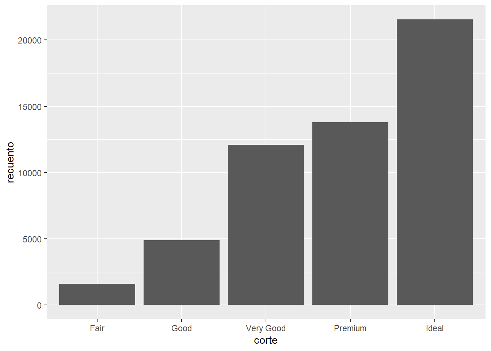

# Repaso de conceptos estadísticos

## Medidas representativas

Vamos a repasar los siguientes conceptos:

- **Promedio**
- **Mediana**
- **Moda**
- Ratio
- Cuartiles
- Percentiles
- Rango
- Rango intercuartil
- Desviación Estándar

Generalmente, cuando hablamos de medidas de tendencia central, nos referimos a los tres primeros.

Estas definiciones vienen directamente o adaptadas de Wikipedia.

Vamos a ver cómo se comportan estas medidas en dos conjuntos de datos:


```r
primer_conjunto <- c(14, 14, 20, 20, 31, 31, 31, 42, 43, 50, 97)
segundo_conjunto <- c(14, 14, 20, 20, 31, 31, 31, 42, 43, 50, 2000)
```

### Promedio

Es un solo número tomado como representante de una lista de números. A menudo, "promedio" se refiere a la media aritmética, la suma de los números dividida por cuántos números se promedian.

$$
promedio=\frac{X_1 + X_2 + ... + X_n}{n}
$$


Si tuviéramos estos 5 números:

$$
11, 14, 16, 19, 20
$$

El promedio se calcularía:

$$
\frac{11 + 14+16+19+20}{5}
$$


Si tuviéramos estos 7 números:

$$
100, 100, 100, 101, 153, 197, 2048
$$

El promedio se calcularía:

$$
\frac{100+100+100+101+153+197+2048}{7}
$$


El promedio es la medida más usada cuando se trata de resumir datos.

-   Promedio de estatura

-   Precio promedio de un producto en el mercado

-   PBI per cápita (promedio del producto bruto interno de una población)


Su principal ventaja es que tiene propiedades matemáticas que permiten hacer cálculos en base a su valor. Por ejemplo: varianza, desviación estándar, ponderaciones, etc.

Su principal desventaja es que es muy susceptible a valores extremos o poco comunes.

En R, usamos la función `mean()` para calcular el promedio de un listado de números.


```r
mean(primer_conjunto)
#> [1] 35.72727
mean(segundo_conjunto)
#> [1] 208.7273
```

### Mediana

Un valor que representa la posición central en un listado de números ordenados. En otras palabras, me divide el conjunto de datos en dos mitades.

$$
10,11, 13, \color{red}{16}, 19, 21, 23
$$

Su principal ventaja es que no es susceptible a los valores extremos o atípicos.

$$
10, 11, 13, \color{red}{16}, 19, 21,2048
$$


En R, usamos la función `median()` para calcular la mediana.


```r
median(primer_conjunto)
#> [1] 31
median(segundo_conjunto)
#> [1] 31
```

### Moda

La moda es el valor que aparece con mayor frecuencia en un conjunto de datos.

$$
\color{red}{11},
\color{red}{11}, 13, 15, 16
$$

Ten en cuenta que en ciertos conjuntos de datos, puede haber más de una moda.

$$
\color{red}{11}, \color{red}{11}, 13, 14, \color{green}{16}, \color{green}{16}, 18
$$

Su utilidad es mayor cuando queremos resumir variables cualitativas.

### Ratio

La razón es una relación binaria entre magnitudes. En el caso de números toda razón se puede expresar como una fracción y eventualmente como un decimal.

En otras palabras, podemos usarla para expresar la relación entre dos mediciones.


Por ejemplo:

$$
\frac{N\, de\, estudiantes}{N\, de\, docentes}
$$

Por ejemplo:

$$
\frac{m^2}{habitantes}
$$ Por ejemplo:

$$
\frac{ancho}{alto}
$$


Para calcular un ratio en R, basta con aplicar una división:


```r
n_docentes <- 50
n_estudiantes <- 1050

ratio <- n_estudiantes/n_docentes

ratio
#> [1] 21
```

Quiere decir que por cada docente en la institución, hay 21 estudiantes.

### Cuartiles y percentiles

Del mismo modo que la mediana nos permite dividir el conjunto de datos en dos partes iguales, los cuartiles nos permiten dividir el conjunto de datos en cuatro partes iguales.

También existen los percentiles, que permiten dividir el conjunto de datos en 100 partes iguales.


R proporciona la función `quantile()` para encontrar la posición deseada. Recuerda que el percentil 25 es equivalente al cuartil 1 (25%) y el percentil 75 es equivalente al cuartil 3 (75%).


```r
# Cuartil 1
quantile(primer_conjunto, 0.25)
#> 25% 
#>  20
# Cuartil 3
quantile(primer_conjunto, 0.75)
#>  75% 
#> 42.5
```


También ten en cuenta que el percentil 50, el cuartil 2 y la mediana son el mismo valor.


```r
quantile(primer_conjunto, 0.5)
#> 50% 
#>  31
median(primer_conjunto)
#> [1] 31
```

### Rango

El Rango es el intervalo entre el valor máximo y el valor mínimo. Permite obtener una idea de la dispersión de los datos, cuanto mayor es el rango, aún más dispersos están los datos.

Por ejemplo, en el siguiente conjunto de datos:

$$
\color{red}{11}, 13, 15, 16, 18, 21, \color{green}{22} 
$$ El rango se calcula así:

$$
Rango = \color{green}{22} - \color{red}{11} = 9
$$


En R, podemos obtenemos el intervalo con la función `range()` . Esto nos brinda el valor mínimo y máximo.


```r
range(primer_conjunto)
#> [1] 14 97
```

Podemos calcular el valor específico con una operación sencilla:


```r
max(primer_conjunto) - min(primer_conjunto)
#> [1] 83
```

Recuerda que el valor será sensible a los valores extremos.


```r
max(segundo_conjunto) - min(segundo_conjunto)
#> [1] 1986
```

### Rango intercuartil

Es una medida de dispersión basada en los cuartiles. Resultado de la diferencia entre el tercer y primer cuartil.

$$
IQR = Q_3 - Q_1
$$

En R se puede calcular con la función `IQR()`:


```r
IQR(primer_conjunto)
#> [1] 22.5
quantile(primer_conjunto, 0.75) - quantile(primer_conjunto, 0.25)
#>  75% 
#> 22.5
```

### Desviación estándar

Es una medida que se utiliza para cuantificar la variación o la dispersión de un conjunto de datos numéricos.

Una desviación estándar baja indica que la mayor parte de los datos de una muestra tienden a estar agrupados cerca de su media, mientras que una desviación estándar alta indica que los datos se extienden sobre un rango de valores más amplio.

Será susceptible a los valores extremos.


En R, podemos calcular la desviación estándar con la función `sd()`, por (*standard deviation*).


```r
sd(primer_conjunto)
#> [1] 23.57155
sd(segundo_conjunto)
#> [1] 594.218
```

## Tipos de variables

### Variables numéricas

Las variables numéricas son aquellas que representan números, y con ellas se pueden realizar operaciones aritméticas. Por ejemplo:

- Número de estudiantes
- Tasa de mortalidad infantil
- Peso corporal
- Temperatura

Las variables numéricas pueden ser continuas o discretas

#### Variables numéricas continuas

Son variables que tienen un número infinito de valores entre dos valores cualquiera. Es decir, son medidas dentro de un rango *continuo* infinito de valores. Algunos ejemplos:

- Longitud de un animal
- Tiempo transcurrido entre compras
- Temperatura de un horno
- Estatura de una persona

Por lo general estamos hablando de datos que se obtienen mediante procesos de medición.

#### Ejemplo

Tomamos la estatura de dos personas, la primera mide 1.70m y la segunda 1.73m. ¿Cuántos valores posibles de estatura existen entre 1.70 m y 1.73m?

Podríamos estar tentados a pensar que los únicos valores posibles serían 1.71m y 1.72m. Sin embargo, si tenemos un instrumento de medición más preciso podría darnos un valor de 1.701m, 1.7113m, 1.70000001, 1.729999999, etc. Es decir, entre dos valores cualquiera de estatura, podemos tener infinitos valores.

#### Variables numéricas discretas

Son variables que tienen un número contable de valores entre dos valores cualquiera. Algunos ejemplos:

- Total de goles en un partido de fútbol
- Número de quejas recibidas por un cliente
- Número de ventas realizadas en una semana
- Número de hijos que una mujer dio a luz

Por lo general estamos hablando de datos que se obtienen mediante procesos de conteo o registro.

#### Ejemplo

Tomamos la cantidad de hijos que tuvieron dos mujeres, la primera tuvo 3 hijos y la segunda tuvo 6. ¿Cuántos valores posibles de número de hijos existen entre 3 y 6?

En este caso, sí es posible decir que entre 3 y 6 sólo es posible tener 4 o 5 hijos. En ningún escenario posible una persona podría decir que tuvo 3.1, 4.5 o 5.999 hijos. Es decir, entre dos valores cualquiera de número de hijos por persona, tenemos un número limitado de valores posibles.

#### Salvedades

En algunos casos, las variables discretas tienen un rango muy grande de valores potenciales y tiene sentido tratarlos como variables continuas en nuestras tareas estadísticas. Por ejemplo:

- Número de personas en un país (población)
- Número de árboles en un bosque
- Número de animales en una reserva protegida

Piensa en la población de El Vaticano versus la población en China. ¿Cuántos valores potenciales de población existen entre ambos valores? 

### Variables cualitativas o categóricas

Se refieren a características o atributos cuyas posibilidades de variación no se expresan en función de números o cantidades. Las variables categóricas contienen un conjunto finito de categorías o grupos distintos. Por ejemplo:

- Posesión de servicio eléctrico en la vivienda (Sí, No)
- Tipo de material del piso (Tierra, Cemento, Loseta, Parquet)
- Tipo de establecimiento de salud al que acudió una persona (Farmacia, Posta, Clínica, Hospital)
- Nivel de apoyo a la democracia en una escala del 1 al 5 
- Nivel educativo alcanzado (Sin nivel, Primaria, Secundaria, etc)

Las variables categóricas pueden ser nominales u ordinales

#### Variables categóricas ordinales

Las variables categóricas son ordinales cuando sí tienen un orden lógico natural. Es decir, las categorías representan valores que pueden ordenarse de menor a mayor o viceversa. Por ejemplo:

- Nivel educativo
- Grado de apoyo a la democracia (Bajo, Medio, Alto)
- Frecuencia de consumo de gaseosa (Diario, Semanal, Mensual, Anual, etc)

#### Variables categóricas nominales

Las variables categóricas son nominales cuando no tienen un orden lógico natural. Es decir, las categorías no representan valores que pueden ordenarse de menor a mayor, o viceversa. Por ejemplo:

- Sexo (Hombre, Mujer)
- Región de nacimiento
- Tipo de dispositivo (Smartphone, Laptop, PC de escritorio, Tablet)
- Compañía proveedora de internet 


### Tratamiento de las variables en una escala gráfica

Cuando realizamos nuestros gráficos, la computadora trata todos nuestros datos como si fueran números.

Miremos el gráfico de la siguiente diapositiva. Representa la cantidad de diamantes según su tipo de corte.



El gráfico representa el *recuento* de observaciones por cada categoría de la variable *corte*.

Antes de poder representar nuestros datos de forma gráfica, necesitamos, obviamente, tener los datos. En este caso, el set de datos luce de esta manera:


```
#> # A tibble: 5 x 2
#>   corte     recuento
#>   <ord>        <int>
#> 1 Fair          1610
#> 2 Good          4906
#> 3 Very Good    12082
#> 4 Premium      13791
#> 5 Ideal        21551
```

Vemos que la variable *corte* es netamente categórica. Sin embargo, asume una posición en el eje X. Internamente, R trata a las variables categóricas como numéricas discretas para poder representar su información en una escala gráfica. 

Por esto, de ahora en adelante, cuando nos refiramos a variables *discretas*, nos estamos refiriendo tanto a variables categóricas como a numéricas discretas con poca cantidad de valores posibles.

